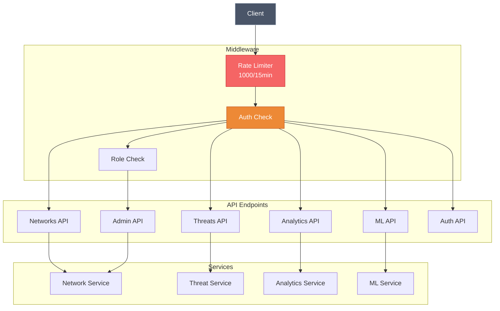
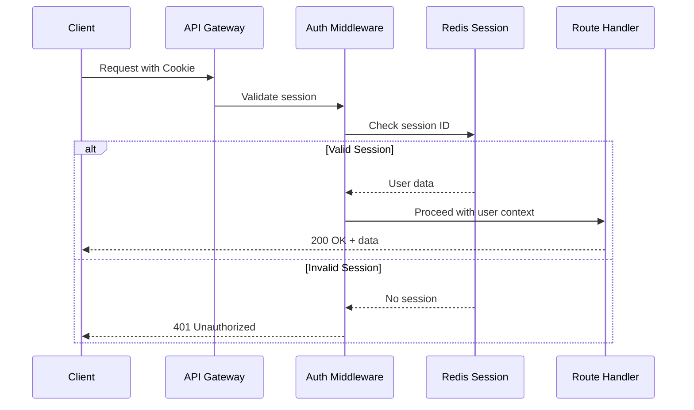
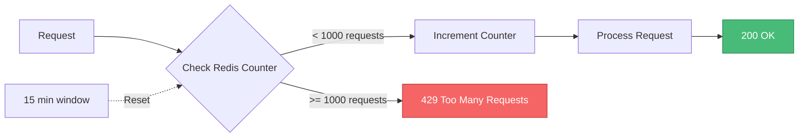
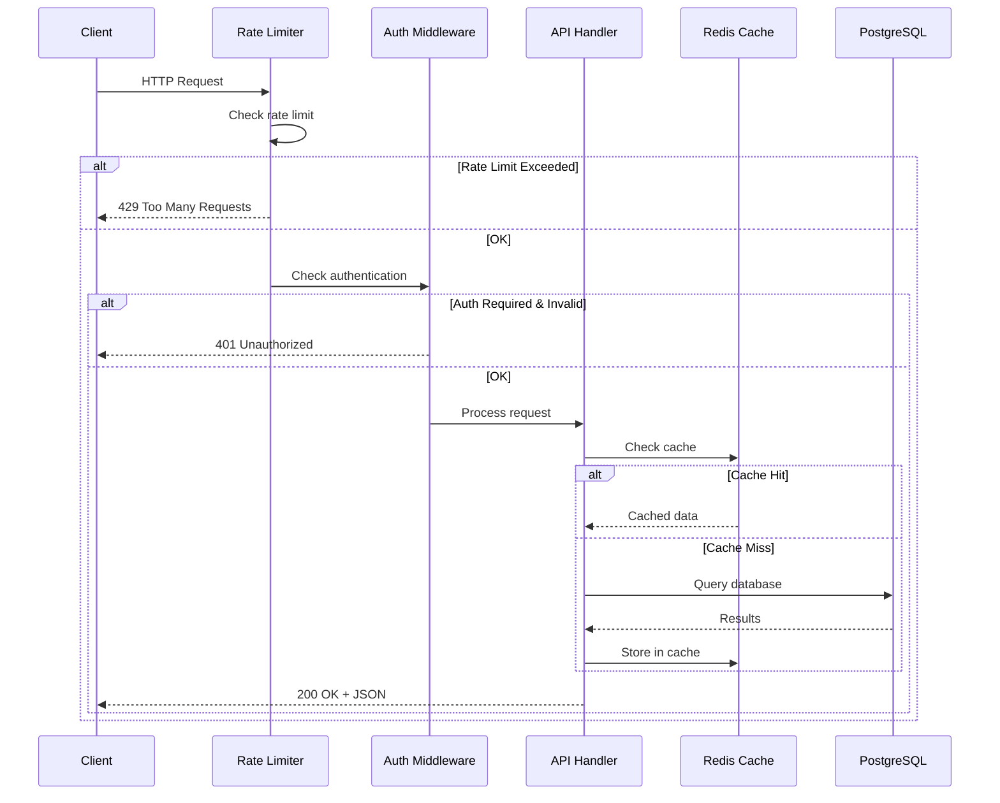

# API Reference

> **Complete REST API documentation for ShadowCheck**

---

## Base URL

```
http://localhost:3001/api
```

---

## API Architecture



---

## Authentication Flow



---

## Authentication

**Session-Based**: Most GET endpoints are public

**Admin Role Required**:

- `POST /api/network-tags/:bssid`
- `POST /api/wigle/detail/:netid` (with import)
- `POST /api/ml/train`
- `POST /api/admin/*`

**API Key Required** (Alternative to session):

```bash
curl -H "x-api-key: your-key" http://localhost:3001/api/admin/backup
```

---

## Rate Limiting



- **Limit**: 1000 requests per 15 minutes per IP
- **Response**: 429 Too Many Requests when exceeded
- **Headers**: `X-RateLimit-Limit`, `X-RateLimit-Remaining`, `X-RateLimit-Reset`

---

## Endpoints Overview

### Networks API

```mermaid
graph LR
    A[/api/networks] --> B[GET List Networks]
    A --> C[GET /observations/:bssid]
    A --> D[GET /search/:ssid]
    A --> E[GET /tagged]
    A --> F[POST /network-tags/:bssid]

    style B fill:#4299e1,stroke:#2b6cb0,color:#fff
    style F fill:#ed8936,stroke:#c05621,color:#fff
```

#### List Networks

```http
GET /api/networks?page=1&limit=100&sort=lastSeen&order=DESC
```

**Query Parameters:**

| Parameter   | Type    | Default  | Description                            |
| ----------- | ------- | -------- | -------------------------------------- |
| `page`      | integer | 1        | Page number                            |
| `limit`     | integer | 100      | Results per page (max 5000)            |
| `sort`      | string  | lastSeen | Sort field                             |
| `order`     | string  | DESC     | Sort order (ASC/DESC)                  |
| `type`      | string  | -        | Filter by network type (W, E, B, etc.) |
| `minSignal` | integer | -        | Minimum signal strength                |
| `maxSignal` | integer | -        | Maximum signal strength                |

**Response:**

```json
{
  "networks": [
    {
      "bssid": "AA:BB:CC:DD:EE:FF",
      "ssid": "Home WiFi",
      "type": "W",
      "encryption": "WPA3-PSK",
      "manufacturer": "Apple",
      "last_seen": "2025-12-02T08:30:00Z",
      "observation_count": 145,
      "threat_score": 15
    }
  ],
  "total": 173326,
  "page": 1,
  "limit": 100
}
```

#### Get Network Observations

```http
GET /api/networks/observations/:bssid
```

**Response:**

```json
{
  "ok": true,
  "data": {
    "bssid": "AA:BB:CC:DD:EE:FF",
    "observations": [
      {
        "lat": 40.7128,
        "lon": -74.006,
        "signal_strength": -65,
        "channel": 6,
        "frequency": 2437,
        "time": "2025-12-02T08:00:00Z"
      }
    ]
  }
}
```

#### Tag Network (Admin)

```http
POST /api/network-tags/:bssid
```

**Request Body:**

```json
{
  "threat_tag": "THREAT",
  "threat_confidence": 0.95,
  "notes": "Confirmed tracking device"
}
```

**Tag Types:**

- `INVESTIGATE` - Requires further analysis
- `THREAT` - Confirmed threat
- `SUSPECT` - Suspicious behavior
- `FALSE_POSITIVE` - Not a threat

---

### Threats API

```mermaid
graph LR
    A[/api/threats] --> B[GET /quick]
    A --> C[GET /detect]

    style B fill:#f56565,stroke:#c53030,color:#fff
    style C fill:#ed8936,stroke:#c05621,color:#fff
```

#### Quick Threat Detection

```http
GET /api/threats/quick?page=1&limit=100&minSeverity=40
```

**Query Parameters:**

| Parameter     | Type    | Default | Description          |
| ------------- | ------- | ------- | -------------------- |
| `page`        | integer | 1       | Page number          |
| `limit`       | integer | 100     | Results per page     |
| `minSeverity` | integer | 40      | Minimum threat score |

**Response:**

```json
{
  "threats": [
    {
      "bssid": "AA:BB:CC:DD:EE:FF",
      "ssid": "Hidden Network",
      "threat_score": 75,
      "rule_score": 60,
      "ml_score": 0.85,
      "distance_range_km": 2.5,
      "observation_count": 45,
      "seen_at_home": true,
      "seen_away_from_home": true,
      "max_speed_kmh": 65,
      "unique_days": 12
    }
  ],
  "pagination": {
    "page": 1,
    "limit": 100,
    "total": 1842,
    "totalPages": 19
  }
}
```

#### Detailed Threat Detection

```http
GET /api/threats/detect
```

Performs comprehensive movement-based forensic analysis.

---

### Analytics API

```mermaid
graph TB
    A[/api/analytics] --> B[/dashboard-metrics]
    A --> C[/network-types]
    A --> D[/signal-strength]
    A --> E[/temporal-activity]
    A --> F[/security]
    A --> G[/radio-type-over-time]
    A --> H[/threat-trends]

    style B fill:#4299e1,stroke:#2b6cb0,color:#fff
```

#### Dashboard Metrics

```http
GET /api/analytics/dashboard-metrics
```

**Response:**

```json
{
  "totalNetworks": 173326,
  "threatsCount": 1842,
  "surveillanceCount": 256,
  "enrichedCount": 45123,
  "avgThreatScore": 28.5,
  "maxDistance": 45.2
}
```

#### Network Types Distribution

```http
GET /api/analytics/network-types
```

**Response:**

```json
{
  "ok": true,
  "data": [
    { "type": "W", "type_name": "WiFi", "count": 145230 },
    { "type": "E", "type_name": "BLE", "count": 18456 },
    { "type": "B", "type_name": "Bluetooth", "count": 9640 }
  ]
}
```

#### Temporal Activity

```http
GET /api/analytics/temporal-activity
```

Returns hourly activity distribution.

---

### Machine Learning API

```mermaid
flowchart LR
    A[/api/ml] --> B[POST /train]
    A --> C[GET /status]
    A --> D[GET /predict/:bssid]

    B --> E[Train Models]
    C --> F[Model Stats]
    D --> G[Threat Prediction]

    style B fill:#ed8936,stroke:#c05621,color:#fff
    style G fill:#f56565,stroke:#c53030,color:#fff
```

#### Train Model (Admin)

```http
POST /api/ml/train
```

**Headers:** `x-api-key: your-key` or valid admin session

**Response:**

```json
{
  "ok": true,
  "model": {
    "type": "logistic_regression",
    "accuracy": 0.92,
    "precision": 0.88,
    "recall": 0.95,
    "f1": 0.91,
    "rocAuc": 0.94
  },
  "trainingData": {
    "totalNetworks": 45,
    "threats": 18,
    "falsePositives": 27
  },
  "message": "Model trained successfully"
}
```

**Errors:**

- `400`: Fewer than 10 tagged networks
- `503`: ML model module unavailable

#### Get Model Status

```http
GET /api/ml/status
```

**Response:**

```json
{
  "ok": true,
  "data": {
    "modelTrained": true,
    "lastTrainedAt": "2025-12-02T10:30:00Z",
    "taggedNetworks": 45,
    "accuracy": 0.92
  }
}
```

#### Predict Threat

```http
GET /api/ml/predict/:bssid
```

Returns ML-based threat prediction for a specific network.

---

### Admin API

```mermaid
graph TB
    A[/api/admin] --> B[POST /import-sqlite]
    A --> C[POST /cleanup-duplicates]
    A --> D[GET /backup]
    A --> E[POST /aws/instances/:id/start]
    A --> F[POST /aws/instances/:id/stop]
    A --> G[GET /pgadmin/status]
    A --> H[POST /pgadmin/start]
    A --> I[POST /pgadmin/stop]

    style B fill:#ed8936,stroke:#c05621,color:#fff
    style D fill:#4299e1,stroke:#2b6cb0,color:#fff
```

All admin endpoints require authentication and admin role.

---

### Weather API

```http
GET /api/weather?lat=40.7128&lon=-74.006
```

Proxies Open-Meteo weather data for map overlays.

**Response:**

```json
{
  "temperature": 15.5,
  "precipitation": 0.2,
  "visibility": 10000,
  "weather_code": 61
}
```

---

## Request/Response Flow



---

## Error Responses

### Standard Error Format

```json
{
  "ok": false,
  "error": "Error message",
  "code": "ERROR_CODE"
}
```

### HTTP Status Codes

| Code | Meaning               | Description                     |
| ---- | --------------------- | ------------------------------- |
| 200  | OK                    | Request successful              |
| 400  | Bad Request           | Invalid parameters              |
| 401  | Unauthorized          | Authentication required         |
| 403  | Forbidden             | Insufficient permissions        |
| 404  | Not Found             | Resource not found              |
| 429  | Too Many Requests     | Rate limit exceeded             |
| 500  | Internal Server Error | Server error                    |
| 503  | Service Unavailable   | Service temporarily unavailable |

---

## Network Type Codes

| Code | Type      | Description              |
| ---- | --------- | ------------------------ |
| `W`  | WiFi      | 802.11 wireless networks |
| `E`  | BLE       | Bluetooth Low Energy     |
| `B`  | Bluetooth | Bluetooth Classic        |
| `L`  | LTE       | 4G cellular networks     |
| `N`  | 5G NR     | 5G New Radio             |
| `G`  | GSM       | 2G/3G cellular           |

---

## Constants

- `MIN_VALID_TIMESTAMP`: 946684800000 (Jan 1, 2000)
- `THREAT_THRESHOLD`: 40 points
- `MAX_PAGE_SIZE`: 5000
- `RATE_LIMIT`: 1000 requests per 15 minutes
- `CACHE_TTL`: 5 minutes

---

## Related Documentation

- [Architecture](Architecture) - System design and data flow
- [Data Flow](Data-Flow) - Complete data flow visualizations
- [Development](Development) - Adding new API endpoints
- [Database](Database) - Database schema reference

---

_Last Updated: 2026-02-07_
