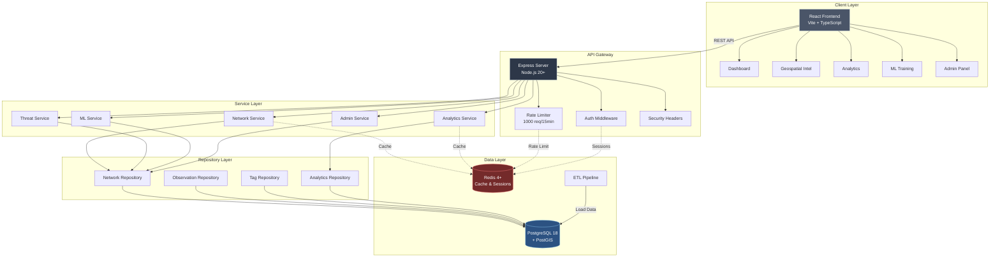
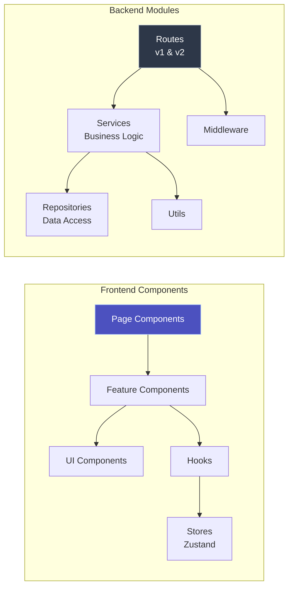
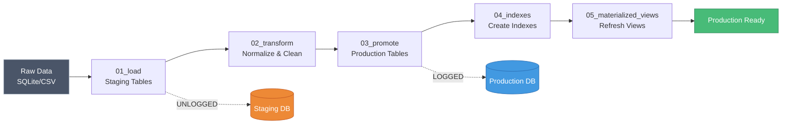
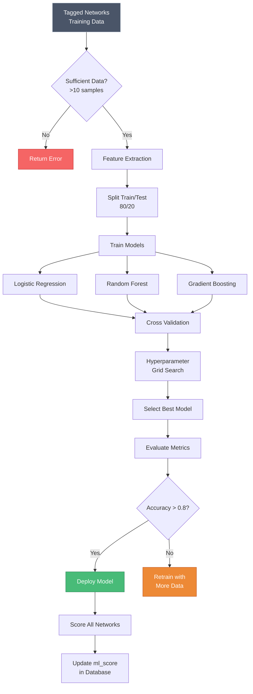
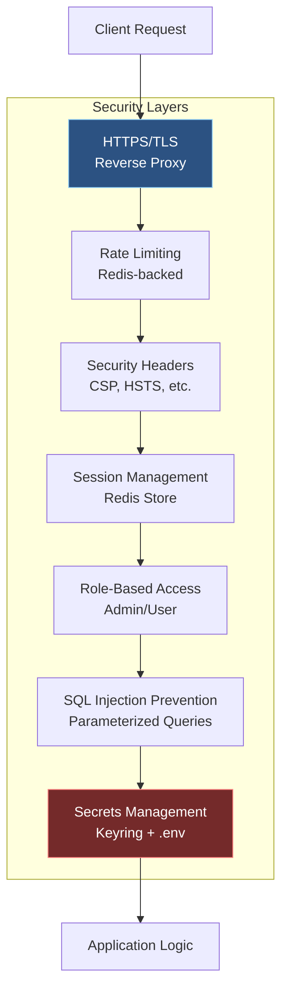
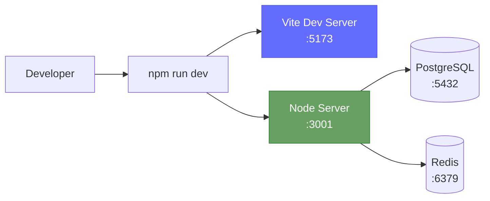
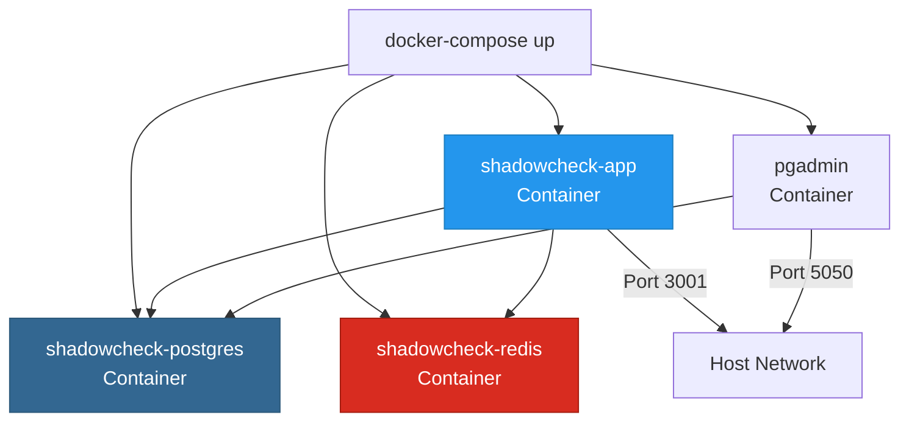
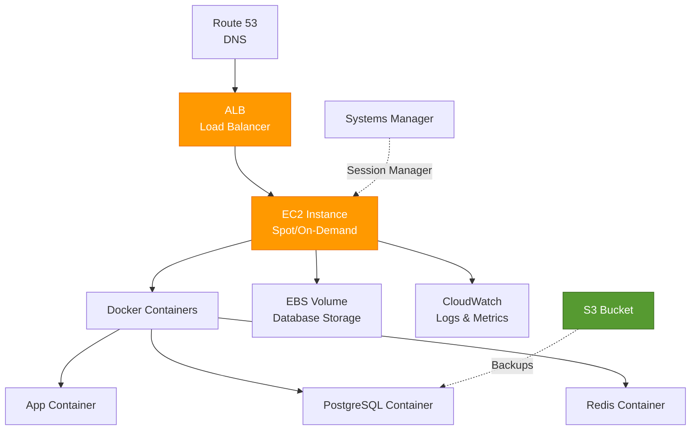
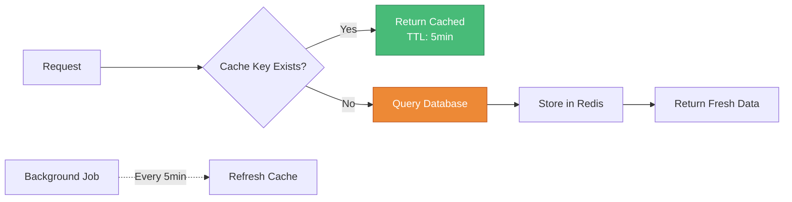
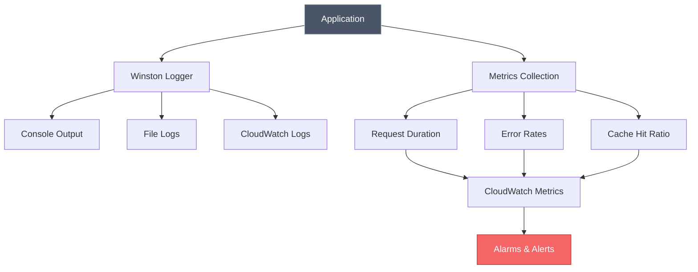

# Architecture

**Docs version (repo):** [docs/ARCHITECTURE.md](../../docs/ARCHITECTURE.md)

> **System architecture and design patterns for ShadowCheck**

---

## Overview

ShadowCheck uses a modern modular architecture combining:

- **React/Vite frontend** with TypeScript and Tailwind CSS
- **Node.js/Express backend** with service/repository pattern
- **PostgreSQL + PostGIS** for geospatial data processing
- **Redis** for caching, sessions, and rate limiting

---

## System Architecture Diagram



---

## Component Architecture



---

## Database Architecture

**Multi-User Security Model:**

- `shadowcheck_user` (Read-Only)
- `shadowcheck_admin` (Full Access)

**Materialized Views:**

- `api_network_explorer_mv` (fast queries)
- `threat_analysis_mv` (threat metrics)
- `analytics_summary_mv` (dashboard metrics)

---

## Project Structure

```
shadowcheck-static/
├── 📁 client/              # React/Vite frontend
│   ├── src/
│   │   ├── components/     # React components (.tsx)
│   │   ├── hooks/          # Custom React hooks
│   │   ├── stores/         # Zustand state management
│   │   ├── utils/          # Utility functions
│   │   └── types/          # TypeScript definitions
│   └── vite.config.ts      # Vite configuration
│
├── 📁 server/              # Express backend
│   ├── server.ts           # Main server entry
│   └── src/
│       ├── api/routes/     # REST API routes (v1 + v2)
│       ├── services/       # Business logic layer
│       ├── repositories/   # Data access layer
│       ├── middleware/     # Express middleware
│       └── utils/          # Server utilities
│
├── 📁 etl/                 # ETL pipeline
│   ├── 01_load/            # Data extraction
│   ├── 03_transform/       # Data transformation
│   └── 05_indexes/         # Index creation
│
├── 📁 scripts/             # Utility scripts
│   ├── import/             # Data import utilities
│   ├── geocoding/          # Geocoding scripts
│   ├── enrichment/         # Address enrichment
│   └── ml/                 # ML training scripts
│
├── 📁 sql/                 # Database
│   ├── functions/          # SQL functions
│   └── migrations/         # Schema migrations
│
└── 📁 docs/                # Documentation
    ├── architecture/       # System architecture
    ├── security/           # Security guides
    └── development/      # Development guides
```

---

## Data Flow

### Threat Detection Request Flow

```
User Request
↓
[Frontend] → GET /api/threats/quick?page=1&limit=100&minSeverity=40
↓
[Middleware] → Rate Limiting → CORS → Authentication
↓
[Route Handler] → Parse & Validate Query Params
↓
[Threat Service] → Calculate Threat Scores
↓
[Repository Layer] → Query Database (CTEs)
↓
[PostgreSQL] → Execute Query with PostGIS Distance Calculations
↓
[Repository Layer] → Map DB Results to Domain Models
↓
[Threat Service] → Apply Pagination & Filtering
↓
[Route Handler] → Format Response
↓
[Frontend] → Render Threat Table
```

### Enrichment Data Flow

```
[WiGLE CSV Import] → Import Script
↓
[PostgreSQL] → app.wigle_networks_enriched
↓
[Enrichment System] → Multi-API Venue Lookup
├─→ [LocationIQ API] → Conflict Resolution
├─→ [OpenCage API] → Voting System
├─→ [Overpass API] → Best Match Selection
└─→ [Nominatim API] → Gap Filling
↓
[PostgreSQL] → app.ap_addresses (venue names, categories)
↓
[Frontend] → Display Enriched Network Data
```

---

## Technology Stack

**Backend:**

- Node.js 20+ (TypeScript)
- Express.js REST API
- PostgreSQL 18 + PostGIS 3.6
- Winston structured logging

**Frontend:**

- React 19 (TypeScript)
- Vite build system
- Tailwind CSS v4
- Mapbox GL JS / Deck.gl
- Zustand state management

**Infrastructure:**

- Docker + Docker Compose
- Jest testing framework
- GitHub Actions CI/CD

---

## Scalability Considerations

### Current Limitations

- Single PostgreSQL instance (no read replicas)
- Connection pool: 20 max connections
- Single-threaded Node.js (no horizontal scaling)

### Scaling Path

**Short-Term (0-100K users)**

- Nginx load balancer
- Multiple API instances
- PostgreSQL read replicas

**Medium-Term (100K-1M users)**

- Redis caching layer
- CDN for static assets
- API rate limiting per user

**Long-Term (1M+ users)**

- Microservices architecture
- Event-driven architecture (Kafka)
- TimescaleDB for time-series data

---

## Related Documentation

- [API Reference](API-Reference) - Complete REST API documentation
- [Development Guide](Development) - Development setup and workflows
- [Database](Database) - Schema and query reference
- [Security](Security) - Security architecture and best practices

sequenceDiagram
participant U as User Browser
participant F as Frontend
participant API as Express API
participant S as Service Layer
participant R as Repository
participant DB as PostgreSQL
participant Cache as Redis

    U->>F: Load Dashboard
    F->>API: GET /api/dashboard-metrics
    API->>Cache: Check cache

    alt Cache Hit
        Cache-->>API: Return cached data
    else Cache Miss
        API->>S: getDashboardMetrics()
        S->>R: Query repositories
        R->>DB: Execute SQL
        DB-->>R: Return results
        R-->>S: Formatted data
        S-->>API: Metrics object
        API->>Cache: Store in cache (5min TTL)
    end

    API-->>F: JSON response
    F-->>U: Render dashboard

````

---

## Request Flow

```mermaid
flowchart TD
    A[HTTP Request] --> B{Rate Limit Check}
    B -->|Exceeded| C[429 Too Many Requests]
    B -->|OK| D{Auth Required?}
    D -->|Yes| E{Valid Session?}
    E -->|No| F[401 Unauthorized]
    E -->|Yes| G[Route Handler]
    D -->|No| G
    G --> H[Service Layer]
    H --> I[Repository Layer]
    I --> J{Cache Available?}
    J -->|Yes| K[Return Cached]
    J -->|No| L[Query Database]
    L --> M[Cache Result]
    M --> N[Return Response]
    K --> N
    N --> O[200 OK]

    style A fill:#4299e1,stroke:#2b6cb0,color:#fff
    style O fill:#48bb78,stroke:#2f855a,color:#fff
    style C fill:#f56565,stroke:#c53030,color:#fff
    style F fill:#f56565,stroke:#c53030,color:#fff
````

---

## Database Schema Overview

```mermaid
erDiagram
    NETWORKS ||--o{ OBSERVATIONS : has
    NETWORKS ||--o{ NETWORK_TAGS : has
    NETWORKS ||--o{ NETWORK_NOTES : has
    NETWORKS ||--o{ NETWORK_MEDIA : has
    NETWORKS ||--o{ SSID_HISTORY : has
    NETWORKS ||--o{ NETWORK_THREAT_SCORES : has

    NETWORKS {
        string bssid PK
        string ssid
        string type
        string manufacturer
        timestamp first_seen
        timestamp last_seen
        integer observation_count
        float threat_score
    }

    OBSERVATIONS {
        bigint id PK
        string bssid FK
        geometry location
        integer signal
        integer channel
        integer frequency
        timestamp observed_at
    }

    NETWORK_TAGS {
        bigint id PK
        string bssid FK
        string tag
        boolean is_threat
        float confidence
        timestamp tagged_at
    }

    NETWORK_NOTES {
        bigint id PK
        string bssid FK
        text note
        timestamp created_at
    }

    NETWORK_MEDIA {
        bigint id PK
        string bssid FK
        string media_type
        string file_path
        timestamp captured_at
    }

    SSID_HISTORY {
        bigint id PK
        string bssid FK
        string ssid
        timestamp first_seen
        timestamp last_seen
    }

    NETWORK_THREAT_SCORES {
        bigint id PK
        string bssid FK
        float rule_score
        float ml_score
        float combined_score
        timestamp calculated_at
    }

    LOCATION_MARKERS ||--o{ NETWORKS : "distance from"
    LOCATION_MARKERS {
        bigint id PK
        string name
        geometry location
        boolean is_home
        float radius_km
    }

    WIGLE_V3_OBSERVATIONS ||--o{ NETWORKS : enriches
    WIGLE_V3_OBSERVATIONS {
        bigint id PK
        string bssid FK
        geometry location
        string source
        timestamp fetched_at
    }

    WIGLE_V3_NETWORK_DETAILS ||--o{ NETWORKS : enriches
    WIGLE_V3_NETWORK_DETAILS {
        bigint id PK
        string bssid FK
        string ssid
        string encryption
        timestamp last_update
    }

    AGENCY_OFFICES {
        bigint id PK
        string name
        string office_type
        geometry location
        string address
        string phone
    }

    USERS ||--o{ USER_SESSIONS : has
    USERS ||--o{ NETWORK_TAGS : creates
    USERS {
        bigint id PK
        string username
        string password_hash
        string role
        timestamp created_at
    }

    USER_SESSIONS {
        string session_id PK
        bigint user_id FK
        timestamp expires_at
    }

    ML_MODEL_METADATA ||--o{ ML_TRAINING_HISTORY : has
    ML_MODEL_METADATA {
        bigint id PK
        string model_type
        float accuracy
        float precision
        float recall
        timestamp trained_at
    }

    ML_TRAINING_HISTORY {
        bigint id PK
        bigint model_id FK
        integer training_samples
        json hyperparameters
        timestamp trained_at
    }

    RADIO_MANUFACTURERS {
        bigint id PK
        string oui_prefix
        string manufacturer
    }

    GEOCODING_CACHE {
        bigint id PK
        geometry location
        string address
        string venue_name
        timestamp cached_at
    }

    ROUTES {
        bigint id PK
        string name
        geometry path
        timestamp recorded_at
    }

    SETTINGS {
        string key PK
        string value
        timestamp updated_at
    }
```

---

## ETL Pipeline Flow



---

## Machine Learning Pipeline



---

## Security Architecture



---

## Deployment Architecture

### Local Development



### Docker Deployment



### AWS Production



---

## Technology Stack Details

### Frontend Stack

| Technology   | Version | Purpose          |
| ------------ | ------- | ---------------- |
| React        | 19.x    | UI framework     |
| TypeScript   | 5.x     | Type safety      |
| Vite         | 7.x     | Build tool       |
| Tailwind CSS | 4.x     | Styling          |
| Mapbox GL JS | 3.x     | Mapping          |
| Zustand      | 5.x     | State management |

### Backend Stack

| Technology | Version | Purpose          |
| ---------- | ------- | ---------------- |
| Node.js    | 20+     | Runtime          |
| Express    | 4.x     | Web framework    |
| PostgreSQL | 18+     | Database         |
| PostGIS    | 3.6+    | Geospatial       |
| Redis      | 4+      | Cache & sessions |
| Winston    | 3.x     | Logging          |
| Jest       | 30.x    | Testing          |
| Winston    | 3.x     | Logging          |
| Jest       | 29.x    | Testing          |

---

## Performance Optimizations

### Caching Strategy



### Database Optimizations

- **Materialized Views**: Pre-computed threat intelligence
- **Spatial Indexes**: GiST indexes on geometry columns
- **Partial Indexes**: Filtered indexes for common queries
- **Connection Pooling**: Reuse database connections
- **UNLOGGED Tables**: Fast staging table inserts

---

## Monitoring & Observability



---

## Scalability Considerations

### Horizontal Scaling

- **Stateless API**: Session data in Redis allows multiple instances
- **Load Balancer**: Distribute traffic across instances
- **Database Read Replicas**: Separate read/write workloads

### Vertical Scaling

- **Connection Pooling**: Optimize database connections
- **Redis Clustering**: Distribute cache across nodes
- **CDN Integration**: Serve static assets from edge locations

---

_Last Updated: 2026-02-07_
