# Data Flow

**Docs references (repo):** [docs/ARCHITECTURE.md](../../docs/ARCHITECTURE.md), [docs/FEATURES.md](../../docs/FEATURES.md)

> **Complete data flow diagrams for ShadowCheck platform**

---

## Overview

This page documents how data flows through the ShadowCheck system, from ingestion to visualization.

---

## Complete Data Flow

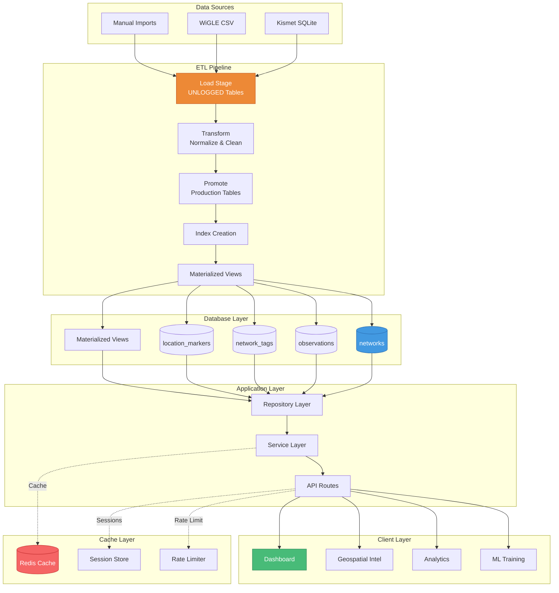

---

## Network Data Flow

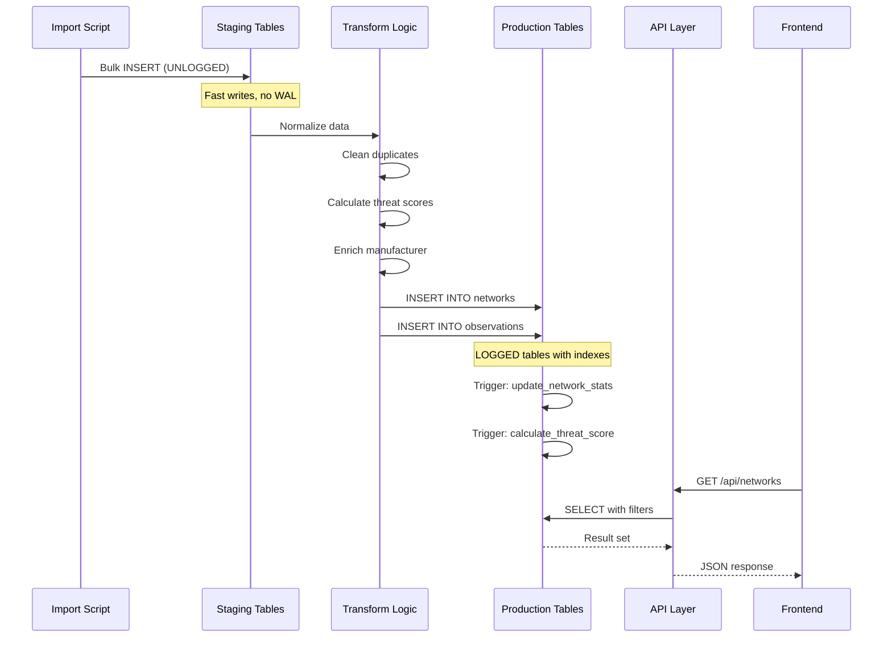

---

## Threat Detection Flow

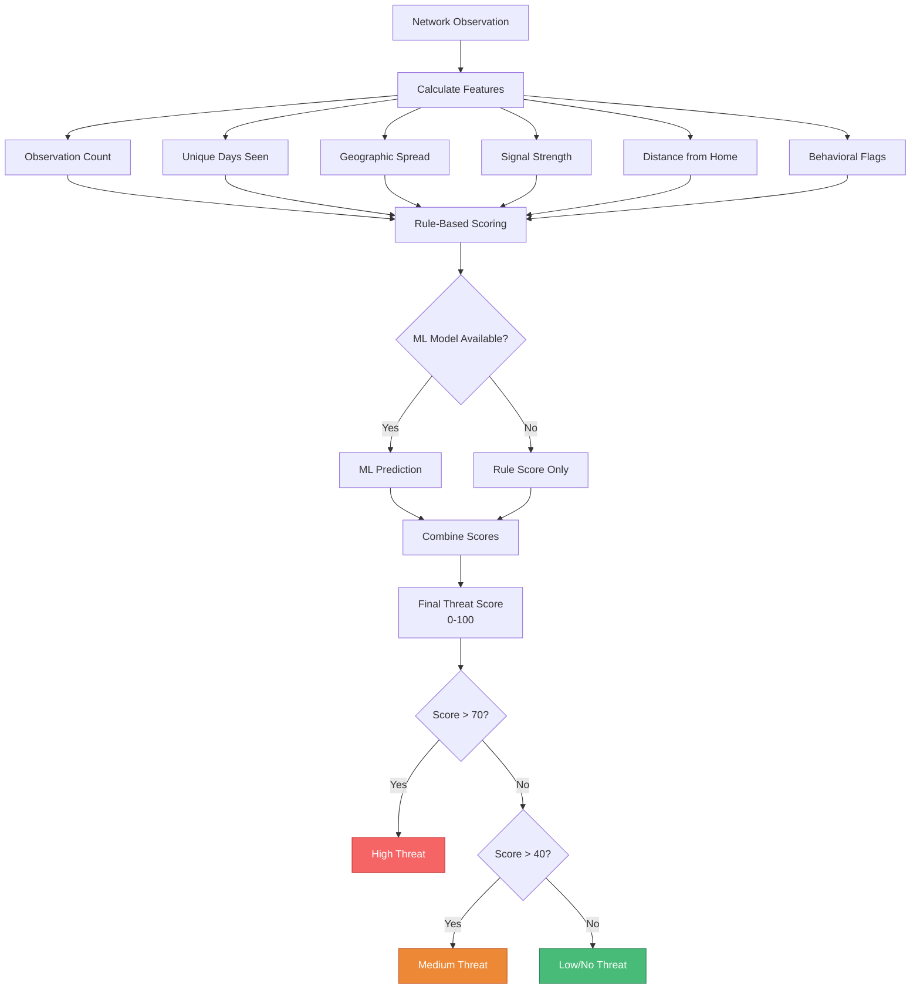

---

## Filter Application Flow

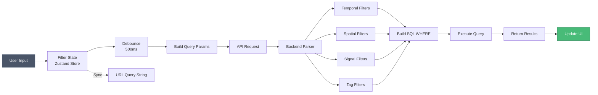

---

## Caching Flow

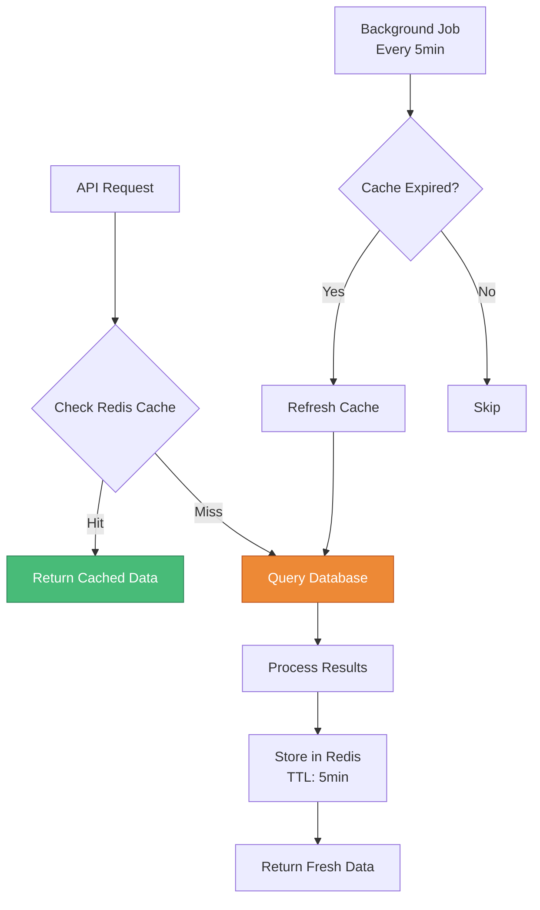

---

## ML Training Flow

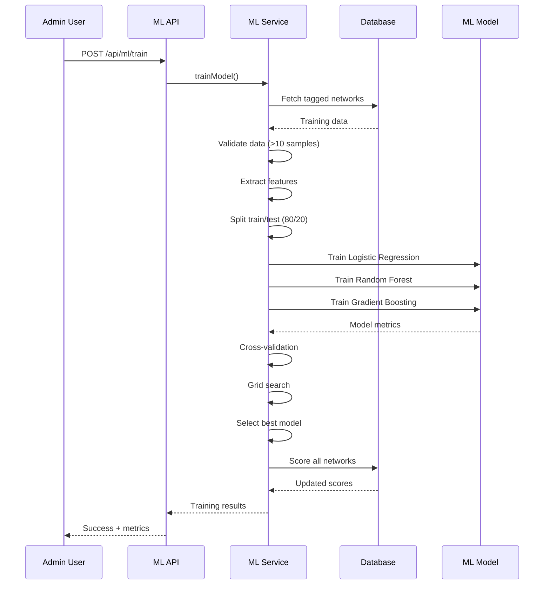

---

## Geospatial Query Flow

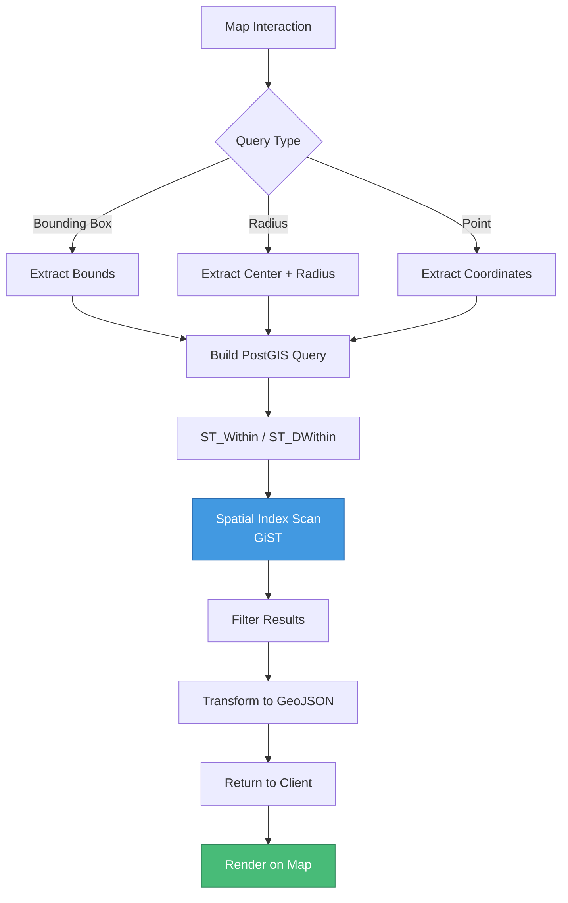

---

## Analytics Aggregation Flow

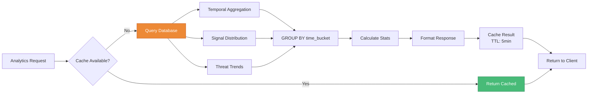

---

## Authentication Flow

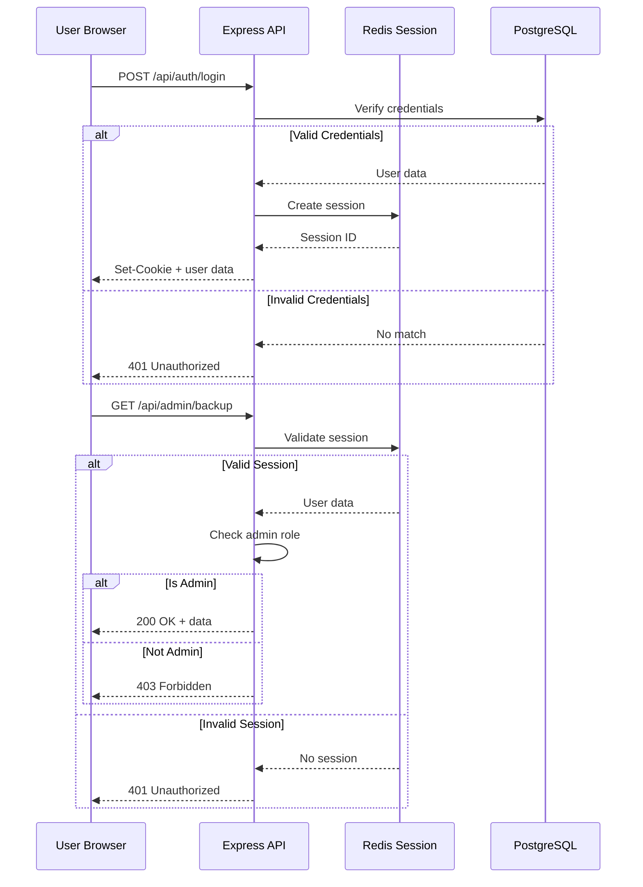

---

## Export Flow

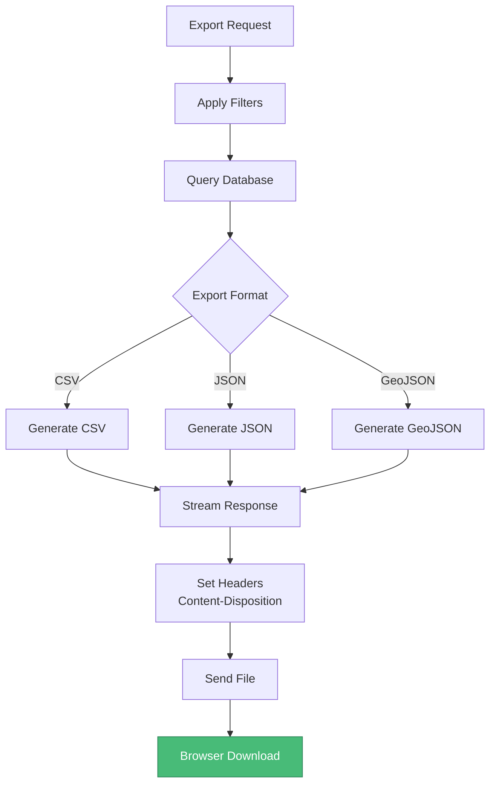

---

## Weather FX Data Flow

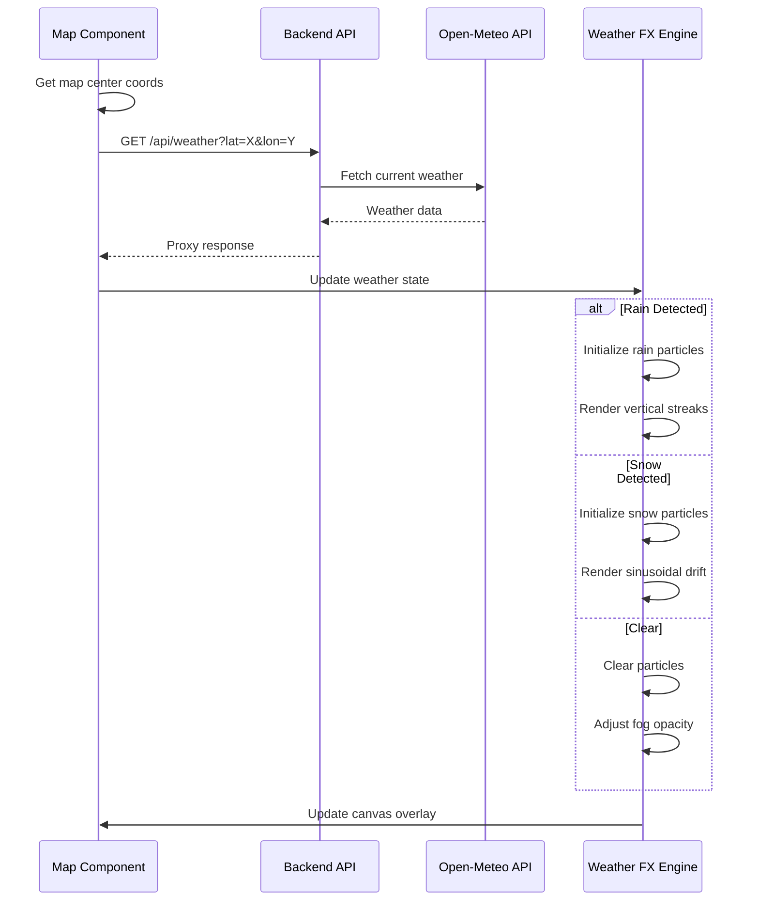

---

## Backup & Restore Flow

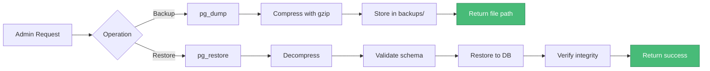

---

## Real-Time Update Flow

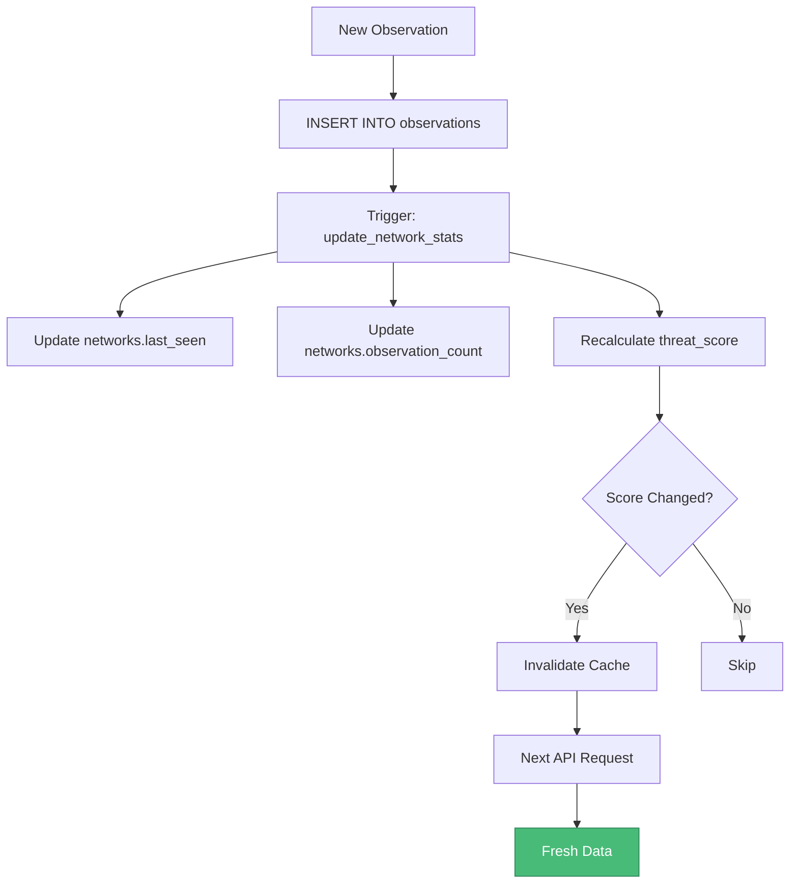

---

_Last Updated: 2026-02-07_
