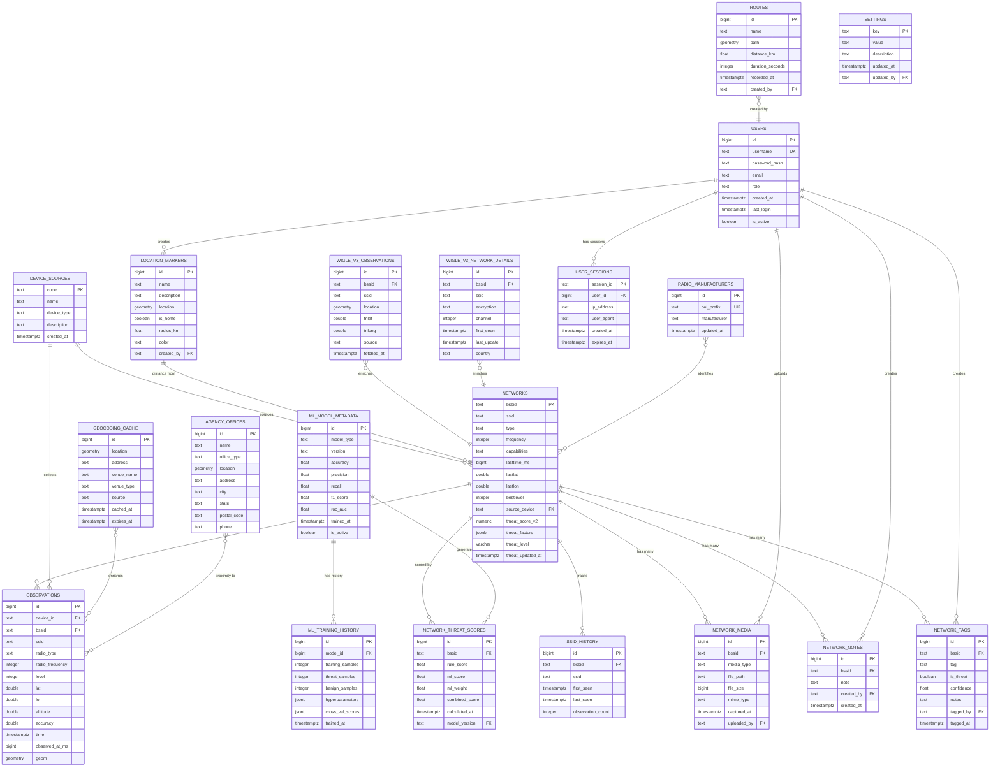

# Database Schema Reference

**Docs version (repo):** [docs/DATABASE_RADIO_ARCHITECTURE.md](../../docs/DATABASE_RADIO_ARCHITECTURE.md)

> **Complete field-level documentation for all tables**

---

## Complete Database Schema Diagram

---

## Table of Contents

- [Core Tables](#core-tables)
  - [networks](#networks)
  - [observations](#observations)
  - [network_tags](#network_tags)
  - [network_notes](#network_notes)
  - [network_media](#network_media)
  - [ssid_history](#ssid_history)
  - [network_threat_scores](#network_threat_scores)
- [Geospatial Tables](#geospatial-tables)
  - [location_markers](#location_markers)
  - [routes](#routes)
  - [geocoding_cache](#geocoding_cache)
- [WiGLE Integration](#wigle-integration)
  - [wigle_v3_observations](#wigle_v3_observations)
  - [wigle_v3_network_details](#wigle_v3_network_details)
- [Agency Data](#agency-data)
  - [agency_offices](#agency_offices)
- [Authentication](#authentication)
  - [users](#users)
  - [user_sessions](#user_sessions)
- [Machine Learning](#machine-learning)
  - [ml_model_metadata](#ml_model_metadata)
  - [ml_training_history](#ml_training_history)
- [Reference Data](#reference-data)
  - [radio_manufacturers](#radio_manufacturers)
  - [device_sources](#device_sources)
  - [settings](#settings)

---

## Core Tables

### networks

Primary network registry with threat scoring.

| Column            | Type             | Nullable | Default | Description                               |
| ----------------- | ---------------- | -------- | ------- | ----------------------------------------- |
| bssid             | text             | NOT NULL | -       | MAC address (PK, uppercase)               |
| ssid              | text             | NOT NULL | ''      | Network name                              |
| type              | text             | NOT NULL | -       | Radio type (W/E/B/L/N/G)                  |
| frequency         | integer          | NOT NULL | -       | Radio frequency in MHz                    |
| capabilities      | text             | NOT NULL | -       | Security capabilities string              |
| service           | text             | NOT NULL | ''      | Service type                              |
| rcois             | text             | NOT NULL | ''      | Roaming consortium OIs                    |
| mfgrid            | integer          | NOT NULL | 0       | Manufacturer ID                           |
| lasttime_ms       | bigint           | NOT NULL | -       | Last seen timestamp (ms since epoch)      |
| lastlat           | double precision | NOT NULL | -       | Last observed latitude                    |
| lastlon           | double precision | NOT NULL | -       | Last observed longitude                   |
| bestlevel         | integer          | NOT NULL | 0       | Best signal strength (dBm)                |
| bestlat           | double precision | NOT NULL | 0       | Best signal latitude                      |
| bestlon           | double precision | NOT NULL | 0       | Best signal longitude                     |
| source_device     | text             | NULL     | -       | Source device code (FK to device_sources) |
| threat_score_v2   | numeric(5,1)     | NULL     | -       | Combined threat score (0-100)             |
| threat_factors    | jsonb            | NULL     | -       | JSON threat calculation factors           |
| threat_level      | varchar(20)      | NULL     | -       | HIGH/MEDIUM/LOW/NONE                      |
| threat_updated_at | timestamptz      | NULL     | -       | Last threat calculation timestamp         |

**Indexes:**

- `networks_pkey` - PRIMARY KEY btree (bssid)
- `idx_networks_threat_level` - btree (threat_level)
- `idx_networks_threat_score_v2` - btree (threat_score_v2 DESC)
- `idx_networks_threat_updated_at` - btree (threat_updated_at)

**Constraints:**

- `networks_bssid_upper` - CHECK (bssid = upper(bssid))
- `networks_source_device_fkey` - FOREIGN KEY (source_device) REFERENCES device_sources(code)

---

### observations

Individual network observations with geospatial data.

| Column             | Type                 | Nullable | Default   | Description                           |
| ------------------ | -------------------- | -------- | --------- | ------------------------------------- |
| id                 | bigint               | NOT NULL | nextval() | Primary key (auto-increment)          |
| device_id          | text                 | NOT NULL | -         | Observing device code (FK)            |
| bssid              | text                 | NOT NULL | -         | Network MAC address (FK, uppercase)   |
| ssid               | text                 | NULL     | -         | Network name at time of observation   |
| radio_type         | text                 | NULL     | -         | Radio type (W/E/B/L/N/G)              |
| radio_frequency    | integer              | NULL     | -         | Frequency in MHz                      |
| radio_capabilities | text                 | NULL     | -         | Capabilities string                   |
| radio_service      | text                 | NULL     | -         | Service type                          |
| radio_rcois        | text                 | NULL     | -         | Roaming consortium OIs                |
| radio_lasttime_ms  | bigint               | NULL     | -         | Radio timestamp in milliseconds       |
| level              | integer              | NOT NULL | -         | Signal strength (dBm)                 |
| lat                | double precision     | NOT NULL | -         | Latitude (WGS84)                      |
| lon                | double precision     | NOT NULL | -         | Longitude (WGS84)                     |
| altitude           | double precision     | NOT NULL | -         | Altitude in meters                    |
| accuracy           | double precision     | NOT NULL | -         | GPS accuracy in meters                |
| time               | timestamptz          | NOT NULL | -         | Observation timestamp                 |
| observed_at_ms     | bigint               | NOT NULL | -         | Timestamp in milliseconds since epoch |
| external           | boolean              | NOT NULL | false     | External observation flag             |
| mfgrid             | integer              | NOT NULL | -         | Manufacturer ID                       |
| source_tag         | text                 | NOT NULL | -         | Source identifier tag                 |
| source_pk          | text                 | NOT NULL | -         | Source primary key                    |
| geom               | geometry(Point,4326) | NOT NULL | -         | PostGIS point geometry (WGS84)        |
| time_ms            | bigint               | NOT NULL | -         | Time in milliseconds                  |
| observed_at        | timestamptz          | NULL     | GENERATED | Generated from time column            |

**Indexes:**

- `observations_v2_pkey` - PRIMARY KEY btree (id)
- `idx_obs_device_time` - btree (device_id, time)
- `idx_obs_geom_gist` - gist (geom)
- `idx_observations_bssid_time` - btree (bssid, time DESC)
- `idx_observations_geom_gist` - gist (geom) WHERE geom IS NOT NULL
- `idx_observations_time_bssid` - btree (time DESC, bssid)
- `observations_v2_natural_uniq` - UNIQUE (device_id, source_pk, bssid, level, lat, lon, altitude, accuracy, observed_at_ms, external, mfgrid)

**Constraints:**

- `observations_v2_bssid_upper` - CHECK (bssid = upper(bssid))
- `fk_obs_bssid` - FOREIGN KEY (bssid) REFERENCES access_points(bssid) DEFERRABLE INITIALLY DEFERRED
- `observations_v2_device_id_fkey` - FOREIGN KEY (device_id) REFERENCES device_sources(code)

**Triggers:**

- `trigger_mark_threat_recompute` - AFTER INSERT marks network for threat recalculation

---

### network_tags

Manual network classifications for ML training and threat identification.

| Column     | Type        | Nullable | Default   | Description                               |
| ---------- | ----------- | -------- | --------- | ----------------------------------------- |
| id         | bigint      | NOT NULL | nextval() | Primary key                               |
| bssid      | text        | NOT NULL | -         | Network MAC address (FK)                  |
| tag        | text        | NOT NULL | -         | THREAT/SUSPECT/INVESTIGATE/FALSE_POSITIVE |
| is_threat  | boolean     | NOT NULL | false     | Boolean threat flag                       |
| confidence | float       | NULL     | -         | Confidence level (0.0-1.0)                |
| notes      | text        | NULL     | -         | Classification notes                      |
| tagged_by  | text        | NULL     | -         | Username who tagged                       |
| tagged_at  | timestamptz | NOT NULL | NOW()     | Tag creation timestamp                    |
| updated_at | timestamptz | NULL     | -         | Last update timestamp                     |

**Indexes:**

- `network_tags_pkey` - PRIMARY KEY btree (id)
- `idx_network_tags_bssid` - btree (bssid)
- `idx_network_tags_tag` - btree (tag)

---

### network_notes

User notes and annotations for networks.

| Column     | Type        | Nullable | Default   | Description                       |
| ---------- | ----------- | -------- | --------- | --------------------------------- |
| id         | bigint      | NOT NULL | nextval() | Primary key                       |
| bssid      | text        | NOT NULL | -         | Network MAC address (FK)          |
| note       | text        | NOT NULL | -         | Note content (markdown supported) |
| created_by | text        | NOT NULL | -         | Username who created              |
| created_at | timestamptz | NOT NULL | NOW()     | Creation timestamp                |
| updated_at | timestamptz | NULL     | -         | Last update timestamp             |

---

### network_media

Media attachments for networks (photos, audio recordings, etc.).

| Column         | Type        | Nullable | Default   | Description                            |
| -------------- | ----------- | -------- | --------- | -------------------------------------- |
| id             | bigint      | NOT NULL | nextval() | Primary key                            |
| bssid          | text        | NOT NULL | -         | Network MAC address (FK)               |
| media_type     | text        | NOT NULL | -         | image/audio/video/document             |
| file_path      | text        | NOT NULL | -         | Storage path relative to media root    |
| file_size      | bigint      | NOT NULL | -         | File size in bytes                     |
| mime_type      | text        | NOT NULL | -         | MIME type (image/jpeg, audio/mp3, etc) |
| thumbnail_path | text        | NULL     | -         | Thumbnail path for images/videos       |
| captured_at    | timestamptz | NOT NULL | -         | Media capture timestamp                |
| uploaded_by    | text        | NOT NULL | -         | Username who uploaded                  |
| uploaded_at    | timestamptz | NOT NULL | NOW()     | Upload timestamp                       |
| description    | text        | NULL     | -         | Media description                      |

---

### ssid_history

Historical SSID changes for networks (tracks SSID spoofing/changes).

| Column            | Type        | Nullable | Default   | Description                      |
| ----------------- | ----------- | -------- | --------- | -------------------------------- |
| id                | bigint      | NOT NULL | nextval() | Primary key                      |
| bssid             | text        | NOT NULL | -         | Network MAC address (FK)         |
| ssid              | text        | NOT NULL | -         | SSID value                       |
| first_seen        | timestamptz | NOT NULL | -         | First observation with this SSID |
| last_seen         | timestamptz | NOT NULL | -         | Last observation with this SSID  |
| observation_count | integer     | NOT NULL | 0         | Number of times observed         |

**Indexes:**

- `idx_ssid_history_bssid` - btree (bssid)
- `idx_ssid_history_ssid` - btree (ssid)

---

### network_threat_scores

Historical threat score calculations with ML model tracking.

| Column         | Type        | Nullable | Default   | Description                     |
| -------------- | ----------- | -------- | --------- | ------------------------------- |
| id             | bigint      | NOT NULL | nextval() | Primary key                     |
| bssid          | text        | NOT NULL | -         | Network MAC address (FK)        |
| rule_score     | float       | NOT NULL | -         | Rule-based threat score (0-100) |
| ml_score       | float       | NULL     | -         | ML model prediction (0-1)       |
| ml_weight      | float       | NULL     | -         | ML confidence weight (0-1)      |
| ml_boost       | float       | NULL     | -         | ML boost factor                 |
| combined_score | float       | NOT NULL | -         | Final weighted score (0-100)    |
| calculated_at  | timestamptz | NOT NULL | NOW()     | Calculation timestamp           |
| model_version  | text        | NULL     | -         | ML model version used           |
| factors        | jsonb       | NULL     | -         | JSON breakdown of score factors |

**Indexes:**

- `idx_threat_scores_bssid` - btree (bssid)
- `idx_threat_scores_combined` - btree (combined_score DESC)

---

## Geospatial Tables

### location_markers

Saved map locations, home markers, and points of interest.

| Column      | Type                 | Nullable | Default   | Description                           |
| ----------- | -------------------- | -------- | --------- | ------------------------------------- |
| id          | bigint               | NOT NULL | nextval() | Primary key                           |
| name        | text                 | NOT NULL | -         | Marker name                           |
| description | text                 | NULL     | -         | Marker description                    |
| location    | geometry(Point,4326) | NOT NULL | -         | PostGIS point (WGS84)                 |
| is_home     | boolean              | NOT NULL | false     | Home location flag (only one allowed) |
| radius_km   | float                | NULL     | -         | Radius for distance filtering         |
| color       | text                 | NULL     | '#3b82f6' | Marker color (hex)                    |
| icon        | text                 | NULL     | 'marker'  | Icon identifier                       |
| created_at  | timestamptz          | NOT NULL | NOW()     | Creation timestamp                    |
| created_by  | text                 | NOT NULL | -         | Username who created                  |

**Indexes:**

- `location_markers_pkey` - PRIMARY KEY btree (id)
- `idx_location_markers_geom` - gist (location)
- `idx_location_markers_is_home` - btree (is_home) WHERE is_home = true

---

### routes

Recorded movement routes for analysis.

| Column           | Type                      | Nullable | Default   | Description                        |
| ---------------- | ------------------------- | -------- | --------- | ---------------------------------- |
| id               | bigint                    | NOT NULL | nextval() | Primary key                        |
| name             | text                      | NOT NULL | -         | Route name                         |
| description      | text                      | NULL     | -         | Route description                  |
| path             | geometry(LineString,4326) | NOT NULL | -         | PostGIS linestring (WGS84)         |
| distance_km      | float                     | NULL     | -         | Total route distance in kilometers |
| duration_seconds | integer                   | NULL     | -         | Route duration in seconds          |
| recorded_at      | timestamptz               | NOT NULL | -         | Recording start timestamp          |
| created_by       | text                      | NOT NULL | -         | Username who created               |
| color            | text                      | NULL     | '#ef4444' | Route color (hex)                  |

**Indexes:**

- `routes_pkey` - PRIMARY KEY btree (id)
- `idx_routes_path` - gist (path)

---

### geocoding_cache

Cached reverse geocoding results to minimize API calls.

| Column       | Type                 | Nullable | Default   | Description                                        |
| ------------ | -------------------- | -------- | --------- | -------------------------------------------------- |
| id           | bigint               | NOT NULL | nextval() | Primary key                                        |
| location     | geometry(Point,4326) | NOT NULL | -         | PostGIS point (WGS84)                              |
| address      | text                 | NULL     | -         | Full formatted address                             |
| venue_name   | text                 | NULL     | -         | Business/venue name                                |
| venue_type   | text                 | NULL     | -         | Venue category (restaurant, office, etc)           |
| source       | text                 | NOT NULL | -         | API source (opencage/locationiq/abstract/overpass) |
| cached_at    | timestamptz          | NOT NULL | NOW()     | Cache timestamp                                    |
| expires_at   | timestamptz          | NULL     | -         | Cache expiration timestamp                         |
| raw_response | jsonb                | NULL     | -         | Full API response JSON                             |

**Indexes:**

- `geocoding_cache_pkey` - PRIMARY KEY btree (id)
- `idx_geocoding_cache_location` - gist (location)
- `idx_geocoding_cache_expires` - btree (expires_at)

---

## WiGLE Integration

### wigle_v3_observations

WiGLE observation data from API lookups.

| Column     | Type                 | Nullable | Default   | Description              |
| ---------- | -------------------- | -------- | --------- | ------------------------ |
| id         | bigint               | NOT NULL | nextval() | Primary key              |
| bssid      | text                 | NOT NULL | -         | Network MAC address (FK) |
| ssid       | text                 | NULL     | -         | Network name             |
| location   | geometry(Point,4326) | NOT NULL | -         | PostGIS point (WGS84)    |
| trilat     | double precision     | NOT NULL | -         | Trilaterated latitude    |
| trilong    | double precision     | NOT NULL | -         | Trilaterated longitude   |
| source     | text                 | NOT NULL | -         | WiGLE data source        |
| fetched_at | timestamptz          | NOT NULL | NOW()     | API fetch timestamp      |
| wigle_id   | text                 | NULL     | -         | WiGLE internal ID        |

**Indexes:**

- `wigle_v3_observations_pkey` - PRIMARY KEY btree (id)
- `idx_wigle_obs_bssid` - btree (bssid)
- `idx_wigle_obs_location` - gist (location)

---

### wigle_v3_network_details

Detailed WiGLE network information.

| Column      | Type        | Nullable | Default   | Description                           |
| ----------- | ----------- | -------- | --------- | ------------------------------------- |
| id          | bigint      | NOT NULL | nextval() | Primary key                           |
| bssid       | text        | NOT NULL | -         | Network MAC address (FK)              |
| ssid        | text        | NULL     | -         | Network name                          |
| encryption  | text        | NULL     | -         | Security type (WPA2, WPA3, Open, etc) |
| channel     | integer     | NULL     | -         | WiFi channel number                   |
| frequency   | integer     | NULL     | -         | Frequency in MHz                      |
| first_seen  | timestamptz | NULL     | -         | First WiGLE observation               |
| last_update | timestamptz | NULL     | -         | Last WiGLE update                     |
| country     | text        | NULL     | -         | Country code (ISO 3166-1 alpha-2)     |
| region      | text        | NULL     | -         | Region/state code                     |
| city        | text        | NULL     | -         | City name                             |
| fetched_at  | timestamptz | NOT NULL | NOW()     | API fetch timestamp                   |

**Indexes:**

- `wigle_v3_network_details_pkey` - PRIMARY KEY btree (id)
- `idx_wigle_details_bssid` - btree (bssid)

---

## Agency Data

### agency_offices

FBI field offices and resident agencies for geospatial correlation.

| Column         | Type                 | Nullable | Default   | Description                            |
| -------------- | -------------------- | -------- | --------- | -------------------------------------- |
| id             | bigint               | NOT NULL | nextval() | Primary key                            |
| name           | text                 | NOT NULL | -         | Office name                            |
| office_type    | text                 | NOT NULL | -         | FIELD_OFFICE or RESIDENT_AGENCY        |
| location       | geometry(Point,4326) | NOT NULL | -         | PostGIS point (WGS84)                  |
| address        | text                 | NOT NULL | -         | Full street address                    |
| city           | text                 | NOT NULL | -         | City name                              |
| state          | text                 | NOT NULL | -         | State code (2 letters)                 |
| postal_code    | text                 | NOT NULL | -         | ZIP code (ZIP+4 format preferred)      |
| phone          | text                 | NOT NULL | -         | Phone number (normalized to 10 digits) |
| phone_original | text                 | NULL     | -         | Original phone format                  |
| website        | text                 | NULL     | -         | Website URL                            |
| parent_office  | text                 | NULL     | -         | Parent field office name (for RAs)     |
| created_at     | timestamptz          | NOT NULL | NOW()     | Record creation timestamp              |

**Indexes:**

- `agency_offices_pkey` - PRIMARY KEY btree (id)
- `idx_agency_offices_location` - gist (location)
- `idx_agency_offices_type` - btree (office_type)
- `idx_agency_offices_state` - btree (state)

---

## Authentication

### users

User accounts for authentication and authorization.

| Column                | Type        | Nullable | Default   | Description                |
| --------------------- | ----------- | -------- | --------- | -------------------------- |
| id                    | bigint      | NOT NULL | nextval() | Primary key                |
| username              | text        | NOT NULL | -         | Unique username            |
| password_hash         | text        | NOT NULL | -         | Bcrypt password hash       |
| email                 | text        | NULL     | -         | Email address              |
| role                  | text        | NOT NULL | 'user'    | admin or user              |
| created_at            | timestamptz | NOT NULL | NOW()     | Account creation timestamp |
| last_login            | timestamptz | NULL     | -         | Last successful login      |
| is_active             | boolean     | NOT NULL | true      | Account active flag        |
| failed_login_attempts | integer     | NOT NULL | 0         | Failed login counter       |
| locked_until          | timestamptz | NULL     | -         | Account lock expiration    |

**Indexes:**

- `users_pkey` - PRIMARY KEY btree (id)
- `users_username_key` - UNIQUE btree (username)
- `idx_users_email` - btree (email)

---

### user_sessions

Redis-backed session storage (also persisted to PostgreSQL).

| Column        | Type        | Nullable | Default | Description                  |
| ------------- | ----------- | -------- | ------- | ---------------------------- |
| session_id    | text        | NOT NULL | -       | Primary key (UUID v4)        |
| user_id       | bigint      | NOT NULL | -       | User FK                      |
| ip_address    | inet        | NULL     | -       | Client IP address            |
| user_agent    | text        | NULL     | -       | Browser user agent string    |
| created_at    | timestamptz | NOT NULL | NOW()   | Session creation timestamp   |
| expires_at    | timestamptz | NOT NULL | -       | Session expiration timestamp |
| last_activity | timestamptz | NOT NULL | NOW()   | Last activity timestamp      |

**Indexes:**

- `user_sessions_pkey` - PRIMARY KEY btree (session_id)
- `idx_user_sessions_user_id` - btree (user_id)
- `idx_user_sessions_expires` - btree (expires_at)

---

## Machine Learning

### ml_model_metadata

ML model versions, metrics, and deployment tracking.

| Column     | Type        | Nullable | Default   | Description                                         |
| ---------- | ----------- | -------- | --------- | --------------------------------------------------- |
| id         | bigint      | NOT NULL | nextval() | Primary key                                         |
| model_type | text        | NOT NULL | -         | logistic_regression/random_forest/gradient_boosting |
| version    | text        | NOT NULL | -         | Model version (semantic versioning)                 |
| accuracy   | float       | NULL     | -         | Accuracy metric (0-1)                               |
| precision  | float       | NULL     | -         | Precision metric (0-1)                              |
| recall     | float       | NULL     | -         | Recall metric (0-1)                                 |
| f1_score   | float       | NULL     | -         | F1 score (0-1)                                      |
| roc_auc    | float       | NULL     | -         | ROC-AUC score (0-1)                                 |
| trained_at | timestamptz | NOT NULL | NOW()     | Training completion timestamp                       |
| is_active  | boolean     | NOT NULL | false     | Currently deployed model flag                       |
| model_path | text        | NULL     | -         | Serialized model file path                          |

**Indexes:**

- `ml_model_metadata_pkey` - PRIMARY KEY btree (id)
- `idx_ml_model_is_active` - btree (is_active) WHERE is_active = true

---

### ml_training_history

ML training run history with hyperparameters and results.

| Column             | Type        | Nullable | Default   | Description                    |
| ------------------ | ----------- | -------- | --------- | ------------------------------ |
| id                 | bigint      | NOT NULL | nextval() | Primary key                    |
| model_id           | bigint      | NOT NULL | -         | Model FK                       |
| training_samples   | integer     | NOT NULL | -         | Total training samples         |
| threat_samples     | integer     | NOT NULL | -         | Threat-labeled samples         |
| benign_samples     | integer     | NOT NULL | -         | Benign-labeled samples         |
| hyperparameters    | jsonb       | NOT NULL | -         | Model hyperparameters JSON     |
| cross_val_scores   | jsonb       | NULL     | -         | Cross-validation scores JSON   |
| feature_importance | jsonb       | NULL     | -         | Feature importance values JSON |
| trained_at         | timestamptz | NOT NULL | NOW()     | Training start timestamp       |
| duration_seconds   | integer     | NULL     | -         | Training duration in seconds   |
| notes              | text        | NULL     | -         | Training notes                 |

**Indexes:**

- `ml_training_history_pkey` - PRIMARY KEY btree (id)
- `idx_ml_training_model_id` - btree (model_id)

---

## Reference Data

### radio_manufacturers

OUI (Organizationally Unique Identifier) to manufacturer mapping.

| Column       | Type        | Nullable | Default   | Description                               |
| ------------ | ----------- | -------- | --------- | ----------------------------------------- |
| id           | bigint      | NOT NULL | nextval() | Primary key                               |
| oui_prefix   | text        | NOT NULL | -         | MAC prefix (first 6 hex chars, uppercase) |
| manufacturer | text        | NOT NULL | -         | Manufacturer name                         |
| updated_at   | timestamptz | NOT NULL | NOW()     | Last update timestamp                     |

**Indexes:**

- `radio_manufacturers_pkey` - PRIMARY KEY btree (id)
- `radio_manufacturers_oui_prefix_key` - UNIQUE btree (oui_prefix)

---

### device_sources

Data collection devices and sources.

| Column      | Type        | Nullable | Default | Description                       |
| ----------- | ----------- | -------- | ------- | --------------------------------- |
| code        | text        | NOT NULL | -       | Primary key (device code)         |
| name        | text        | NOT NULL | -       | Device name                       |
| device_type | text        | NULL     | -       | Device type (kismet/wigle/manual) |
| description | text        | NULL     | -       | Device description                |
| created_at  | timestamptz | NOT NULL | NOW()   | Registration timestamp            |

**Indexes:**

- `device_sources_pkey` - PRIMARY KEY btree (code)

---

### settings

Application configuration key-value store.

| Column      | Type        | Nullable | Default | Description                             |
| ----------- | ----------- | -------- | ------- | --------------------------------------- |
| key         | text        | NOT NULL | -       | Primary key (setting name)              |
| value       | text        | NOT NULL | -       | Setting value (JSON for complex values) |
| description | text        | NULL     | -       | Setting description                     |
| updated_at  | timestamptz | NOT NULL | NOW()   | Last update timestamp                   |
| updated_by  | text        | NULL     | -       | Username who last updated               |

**Indexes:**

- `settings_pkey` - PRIMARY KEY btree (key)

---

_Last Updated: 2026-02-07_
