# Deployment Guide

> **Complete deployment workflows for all environments**

---

## Deployment Options

ShadowCheck supports three primary deployment scenarios:

1. **Local Development** - Quick setup for development
2. **Docker Compose** - Containerized local/home lab deployment
3. **AWS Production** - Scalable cloud deployment

---

## Deployment Decision Tree

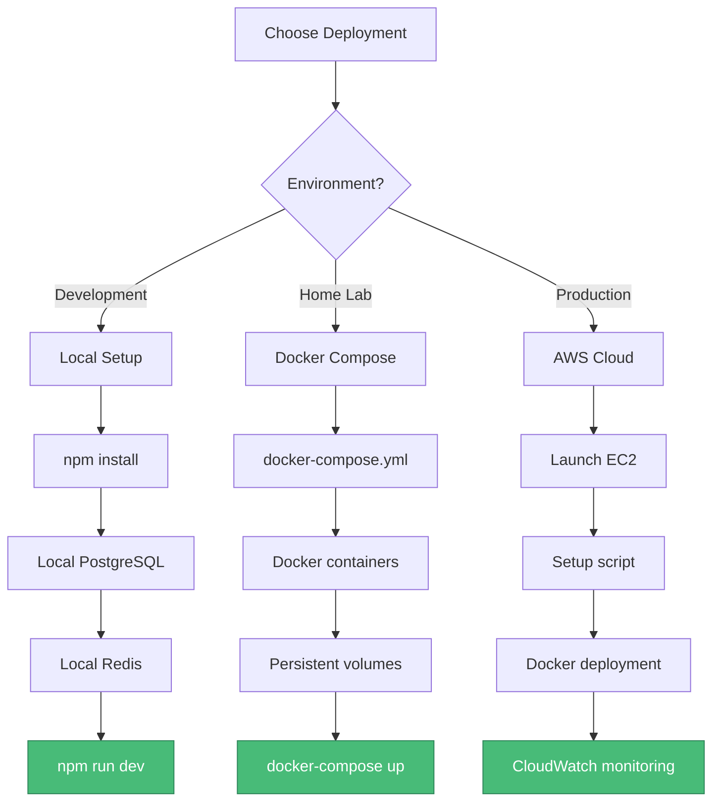

---

## Local Development Setup

### Prerequisites

- Node.js 20+
- PostgreSQL 18+
- Redis 4+
- Git

### Setup Flow

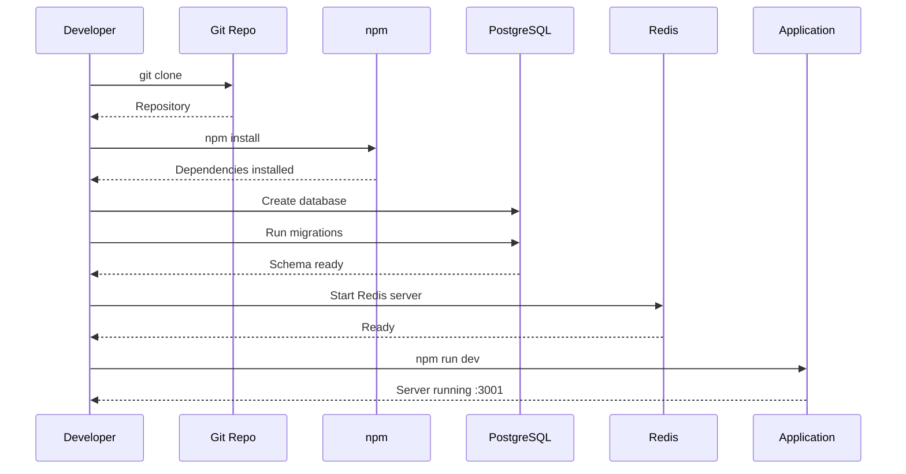

### Quick Start Commands

```bash
# Clone repository
git clone https://github.com/cyclonite69/shadowcheck-static.git
cd shadowcheck-static

# Install dependencies
npm install

# Setup database
createdb shadowcheck_db
psql -d shadowcheck_db -c "CREATE EXTENSION postgis;"
psql -d shadowcheck_db -f sql/migrations/*.sql

# Configure environment
cp .env.example .env
# Edit .env with your credentials

# Start development server
npm run dev
```

---

## Docker Compose Deployment

### Architecture

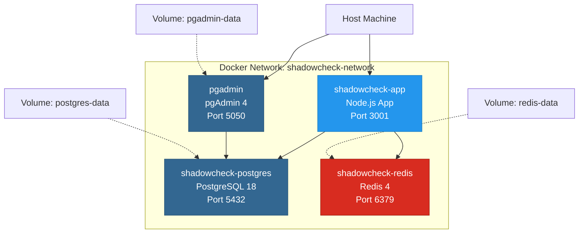

### Deployment Flow

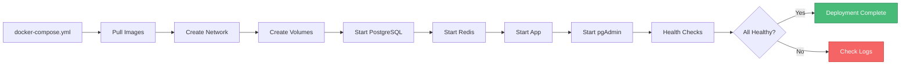

### Commands

```bash
# Start all services
docker-compose up -d

# View logs
docker-compose logs -f

# Stop services
docker-compose down

# Rebuild after changes
docker-compose up -d --build

# Access pgAdmin
# http://localhost:5050
# Email: admin@shadowcheck.local
# Password: admin
```

### Volume Management

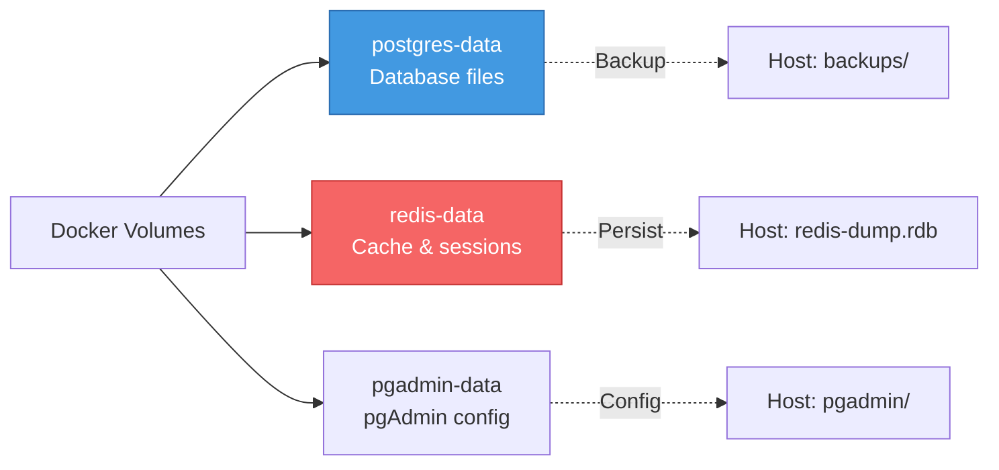

---

## AWS Production Deployment

### Infrastructure Overview

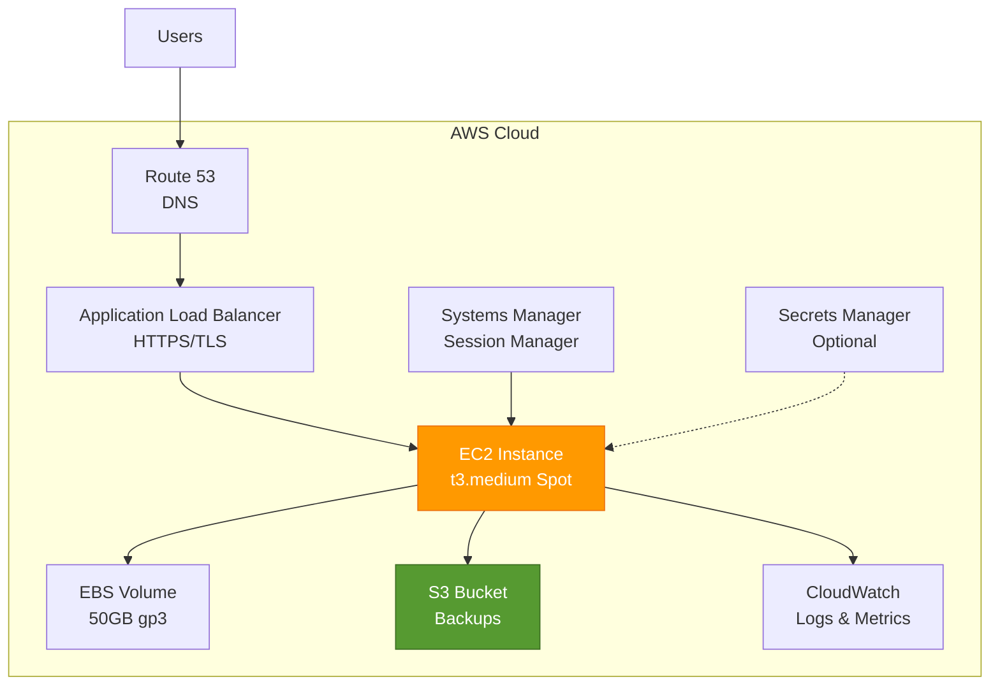

### Deployment Workflow

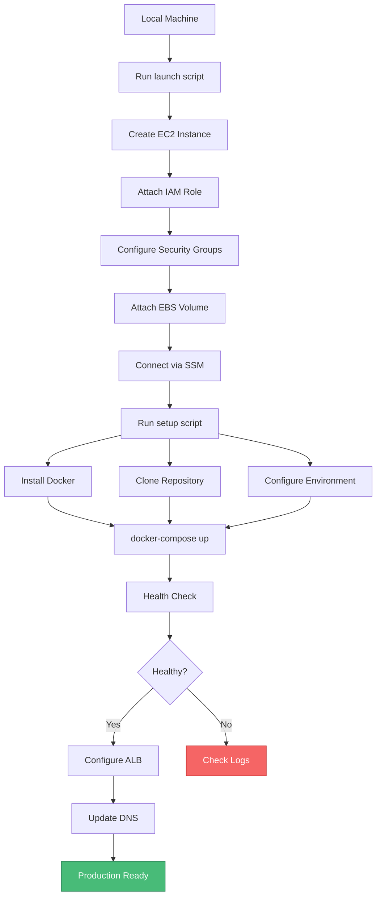

### Launch Script Flow

```bash
# 1. Launch EC2 instance
./deploy/aws/scripts/launch-shadowcheck-spot.sh

# 2. Connect via SSM
aws ssm start-session --target INSTANCE_ID --region us-east-1

# 3. Run automated setup
bash
curl -fsSL https://raw.githubusercontent.com/cyclonite69/shadowcheck-static/master/deploy/aws/scripts/setup-instance.sh | sudo bash

# 4. Deploy application
cd /home/ssm-user/shadowcheck
./deploy/aws/scripts/deploy-complete.sh
```

### Update Workflow

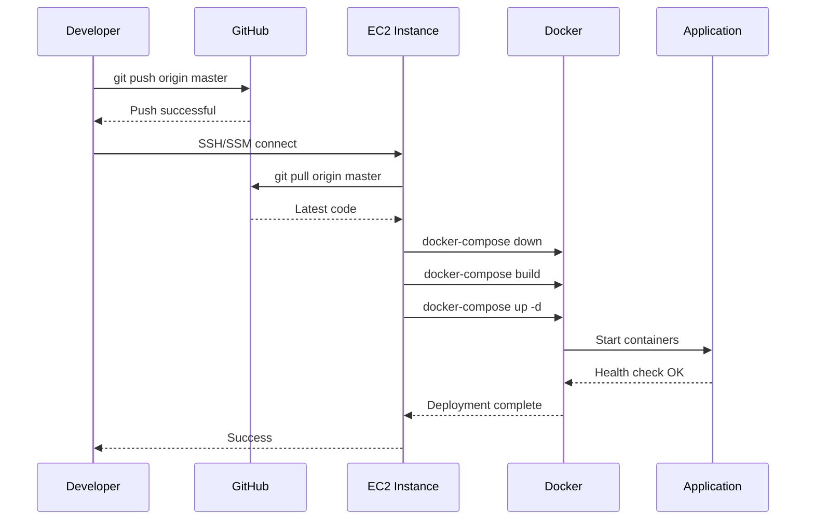

---

## Environment Configuration

### Configuration Hierarchy

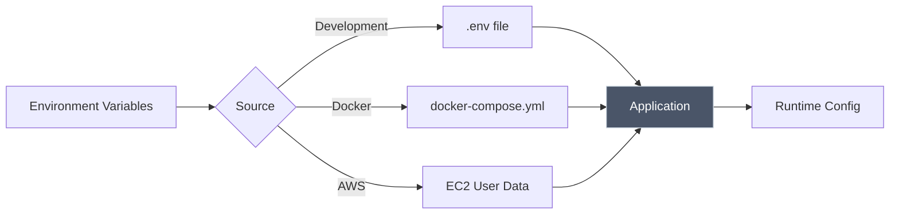

### Required Variables

| Variable      | Development      | Docker               | AWS                  |
| ------------- | ---------------- | -------------------- | -------------------- |
| `DB_HOST`     | localhost        | shadowcheck-postgres | shadowcheck-postgres |
| `DB_PORT`     | 5432             | 5432                 | 5432                 |
| `DB_NAME`     | shadowcheck_db   | shadowcheck_db       | shadowcheck_db       |
| `DB_USER`     | shadowcheck_user | shadowcheck_user     | shadowcheck_user     |
| `DB_PASSWORD` | ⚠️ Required      | ⚠️ Required          | ⚠️ Required          |
| `REDIS_HOST`  | localhost        | shadowcheck-redis    | shadowcheck-redis    |
| `REDIS_PORT`  | 6379             | 6379                 | 6379                 |
| `PORT`        | 3001             | 3001                 | 3001                 |
| `NODE_ENV`    | development      | production           | production           |

---

## Database Migration Strategy

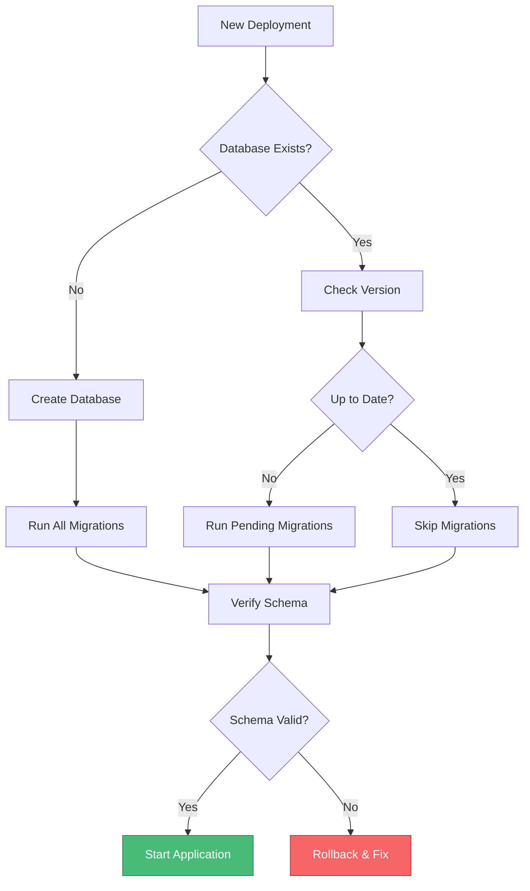

### Migration Order

```bash
# 1. Core schema
psql -f sql/migrations/01_create_tables.sql

# 2. Functions
psql -f sql/functions/create_scoring_function.sql
psql -f sql/functions/fix_kismet_functions.sql

# 3. Triggers
psql -f sql/migrations/02_create_triggers.sql

# 4. Indexes
psql -f sql/migrations/03_create_indexes.sql

# 5. Security
psql -f sql/migrations/20260129_implement_db_security.sql

# 6. Materialized views
psql -f sql/migrations/04_create_materialized_views.sql
```

---

## Health Check & Monitoring

### Health Check Endpoints

```mermaid
flowchart LR
    A[Load Balancer] --> B[/health]
    B --> C{Check Database}
    C -->|OK| D{Check Redis}
    D -->|OK| E[200 OK]
    D -->|Fail| F[503 Service Unavailable]
    C -->|Fail| F

    style E fill:#48bb78,stroke:#2f855a,color:#fff
    style F fill:#f56565,stroke:#c53030,color:#fff
```

### Monitoring Stack

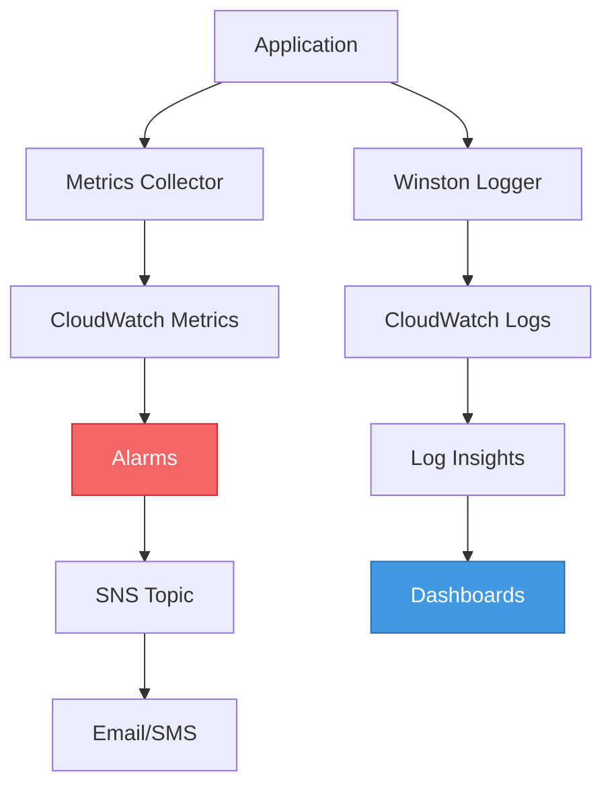

---

## Backup & Disaster Recovery

### Backup Strategy

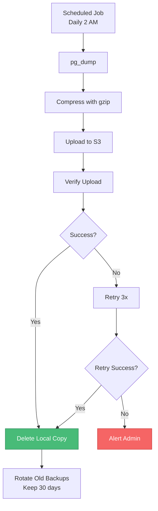

### Restore Process

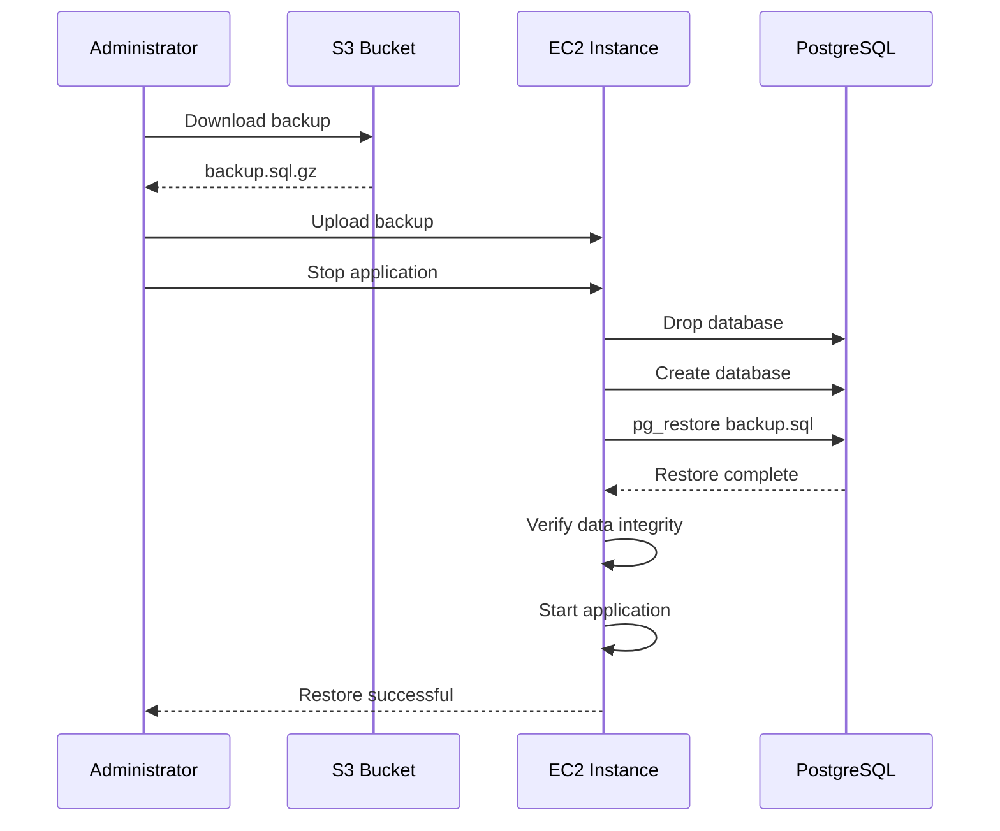

---

## Scaling Strategies

### Vertical Scaling

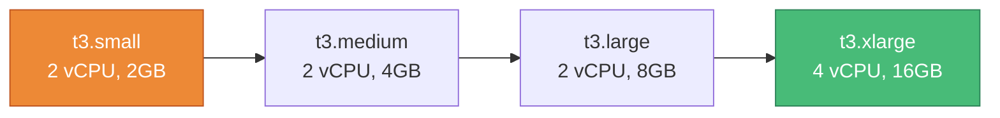

### Horizontal Scaling

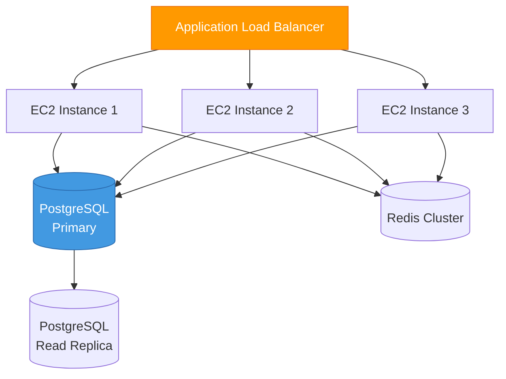

---

## Troubleshooting

### Common Issues

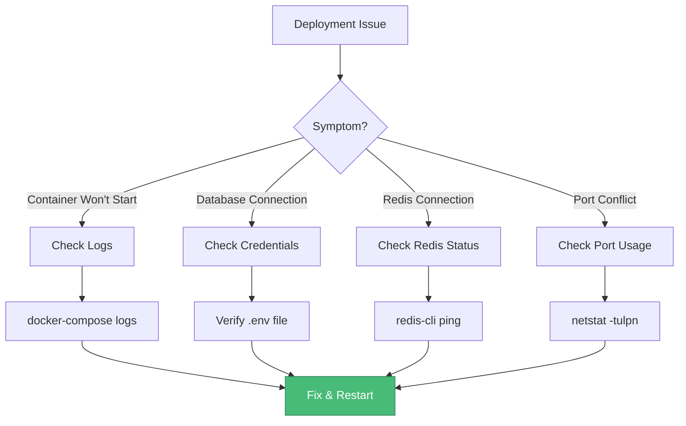

---

## Security Checklist

- [ ] Change default passwords
- [ ] Enable HTTPS/TLS
- [ ] Configure firewall rules
- [ ] Enable CloudWatch logging
- [ ] Setup automated backups
- [ ] Rotate credentials every 90 days
- [ ] Enable MFA for AWS console
- [ ] Review security groups
- [ ] Enable encryption at rest
- [ ] Configure rate limiting

---

_Last Updated: 2026-02-07_
