# Features

**Docs version (repo):** [docs/FEATURES.md](../../docs/FEATURES.md)

> **Complete feature catalog for ShadowCheck**

---

## Feature Overview

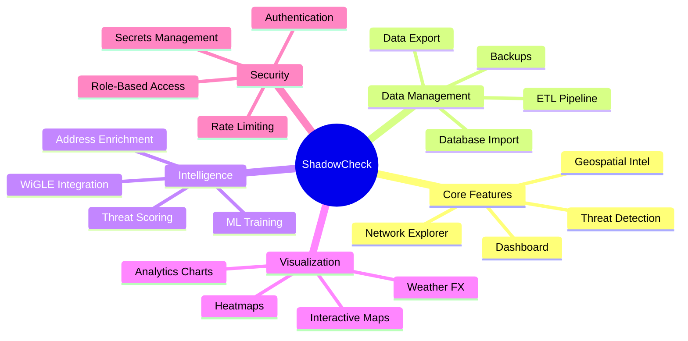

---

## Core UI & Exploration

| Feature                     | Description                                                        |
| --------------------------- | ------------------------------------------------------------------ |
| **Dashboard**               | Real-time metrics cards, threat indicators, filter-aware summaries |
| **Geospatial Intelligence** | Map-based analysis with heatmaps, routes, timeline overlays        |
| **Geospatial Explorer**     | Interactive map view with network selection and tooltips           |
| **Networks Explorer**       | Filtered network table with sorting and manufacturer cues          |
| **Threats Explorer**        | Strong-signal candidate list with quick triage                     |
| **Analytics**               | Temporal activity, radio-type trends, threat score charts          |
| **WiGLE Page**              | Local WiGLE data search with optional live API lookups             |
| **Kepler Page**             | Kepler.gl-ready GeoJSON feeds with filter support                  |
| **API Test Page**           | Endpoint smoke tests and response inspection                       |
| **Admin Page**              | Configuration workflows and operational controls                   |

---

## Dashboard Architecture

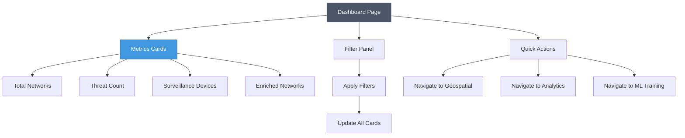

---

## Universal Filter System

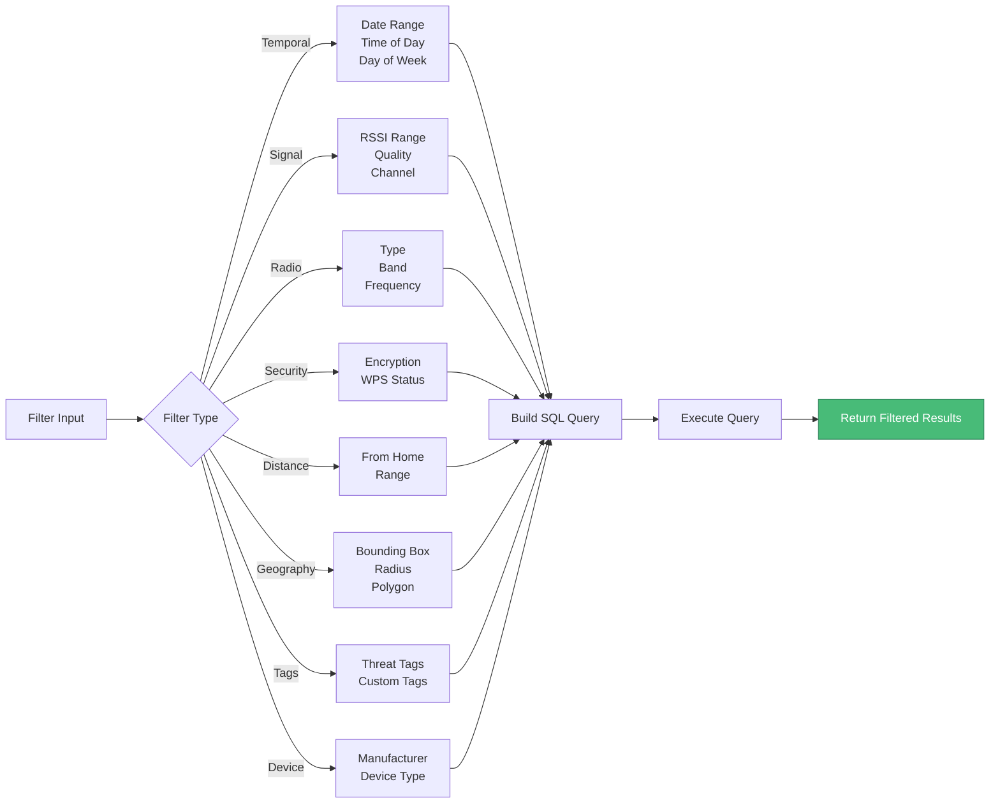

### Filter Types (20+)

- **Time Filters**: Date ranges, hours, days of week
- **Signal Filters**: Strength (RSSI), quality, channel, frequency
- **Radio Filters**: Type (WiFi/BLE/etc.), band (2.4/5GHz), frequency ranges
- **Security Filters**: Encryption type, WPS status
- **Distance Filters**: From home location, distance range
- **Geography Filters**: Bounding box, radius, polygon
- **Tag Filters**: Threat classification, custom tags
- **Device Filters**: Manufacturer (OUI), device type
- **Behavioral Filters**: Seen at home, seen away, movement patterns
- **Observation Filters**: Count, unique days, first/last seen

### Filter Features

- **Page-scoped filters** with URL sync and debounced application
- **Distance-from-home filters** backed by stored home location markers
- **Complex queries** with AND/OR logic
- **Filter presets** for common scenarios
- **Real-time updates** with 500ms debounce

---

## Geospatial & Mapping

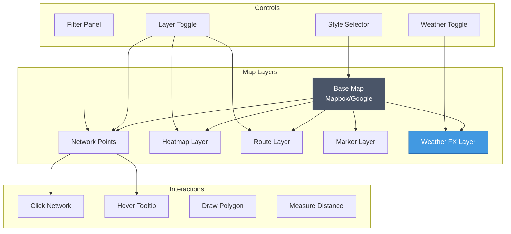

| Feature                | Description                                        |
| ---------------------- | -------------------------------------------------- |
| **Mapbox Integration** | Token management, style proxying, request proxy    |
| **Google Maps Tiles**  | Server-side tile proxy with key management         |
| **Heatmaps**           | Geospatial overlays for movement patterns          |
| **Routes & Timelines** | Movement visualization                             |
| **Location Markers**   | CRUD for saved markers plus radius-based home zone |
| **Unified Tooltips**   | Consistent, rich hover tooltips across map views   |
| **Weather FX**         | Real-time atmospheric visualization                |

---

## Weather FX System

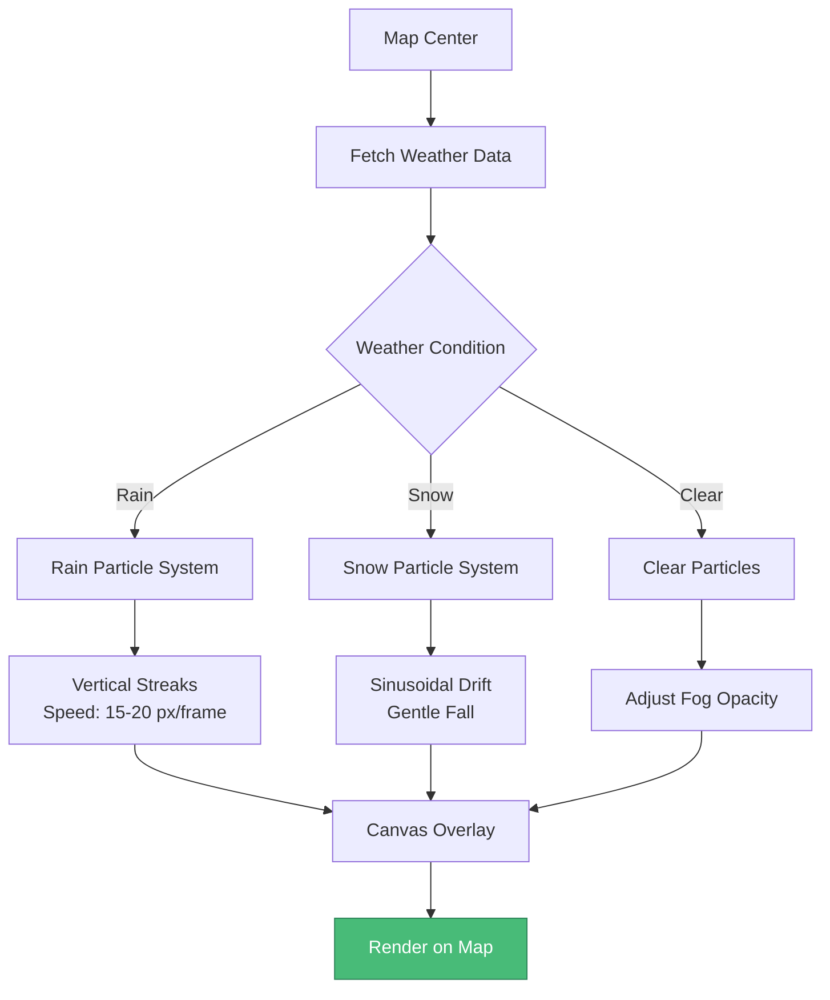

### Weather Features

- **Real-time Weather Overlay**: Dynamic fog, rain, and snow effects
- **Particle System**: High-performance canvas-based rendering
- **Historical Weather**: View past conditions for observation points
- **Backend Proxy**: Secure `/api/weather` endpoints
- **Atmospheric Effects**: Temperature, pressure, visibility data

---

## Threat Detection System

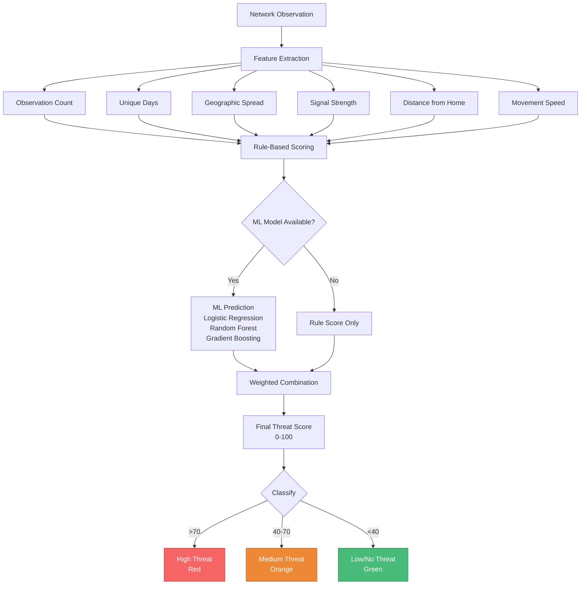

### Threat Detection Features

- **Multi-factor scoring**: Combines 6+ behavioral indicators
- **ML-powered**: Multiple algorithms with hyperparameter optimization
- **Movement analysis**: Speed calculation and pattern detection
- **Home/away detection**: Identifies networks seen in multiple contexts
- **Manual tagging**: Admin can classify networks for training
- **Real-time updates**: Scores recalculated on new observations

---

## Machine Learning Pipeline

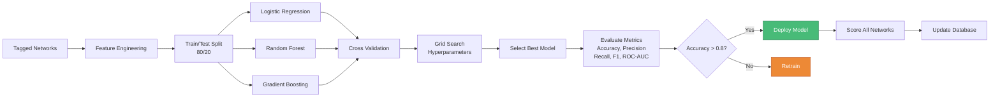

### ML Features

- **Multiple Algorithms**: Logistic Regression, Random Forest, Gradient Boosting
- **Hyperparameter Optimization**: Grid search with cross-validation
- **Model Versioning**: Track training history and metrics
- **Feature Importance**: Understand which factors drive predictions
- **Minimum Data**: Requires 10+ tagged networks for training
- **Automatic Scoring**: Updates all network scores after training

---

## Analytics System

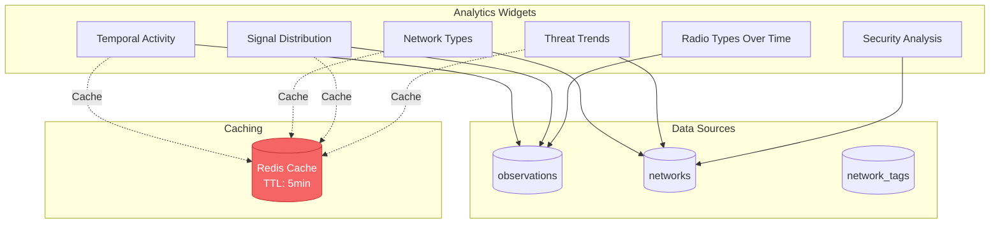

### Analytics Features

- **Chart.js Visualizations**: Interactive, responsive charts
- **Real-time Updates**: Refresh with filter changes
- **Cached Aggregations**: 5-minute TTL for performance
- **Export Capabilities**: Download charts as images
- **Temporal Analysis**: Hourly, daily, weekly patterns
- **Distribution Analysis**: Signal strength, network types, security

---

## Data Import & ETL

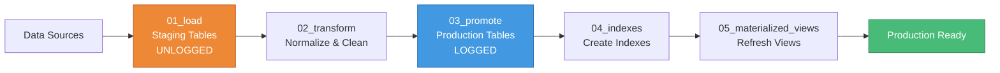

### ETL Features

- **Modular Pipeline**: Separate load/transform/promote steps
- **UNLOGGED Staging**: Fast bulk inserts without WAL overhead
- **Duplicate Detection**: Automatic deduplication
- **Manufacturer Enrichment**: OUI prefix matching
- **Threat Score Calculation**: Automatic scoring on import
- **Materialized Views**: Pre-computed threat intelligence
- **Progress Tracking**: Real-time import status

---

## Address Enrichment

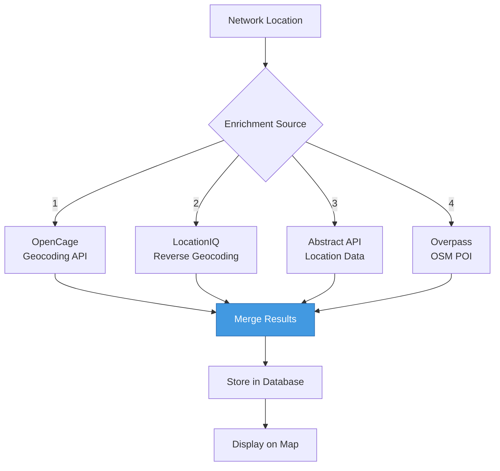

### Enrichment Features

- **Multi-API Support**: 4 data sources for comprehensive coverage
- **Venue Identification**: Businesses, landmarks, addresses
- **Fallback Strategy**: Try multiple sources if one fails
- **Rate Limiting**: Respect API quotas
- **Caching**: Store enriched data to avoid re-querying
- **Manual Override**: Admin can edit enrichment data

---

## Security Features

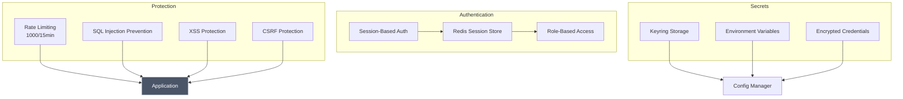

### Security Features

- **Session Management**: Redis-backed sessions with expiration
- **Role-Based Access**: Admin/User roles with permission checks
- **Rate Limiting**: IP-based throttling (1000 req/15min)
- **SQL Injection Prevention**: Parameterized queries throughout
- **Secrets Management**: Keyring + .env for sensitive data
- **Security Headers**: CSP, HSTS, X-Frame-Options, etc.
- **Password Rotation**: 60-90 day rotation policy
- **Audit Logging**: Track admin actions

---

## Export & Backup

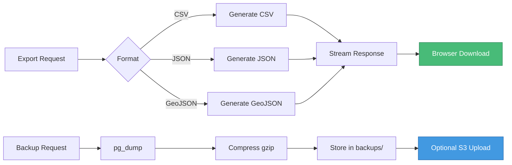

### Export Features

- **Multiple Formats**: CSV, JSON, GeoJSON
- **Filter Support**: Export filtered datasets
- **Streaming**: Handle large exports efficiently
- **Scheduled Backups**: Automated daily backups
- **S3 Integration**: Optional cloud backup storage
- **Restore Capability**: Full database restore from backups

---

## Admin Features

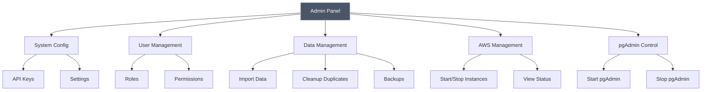

### Admin Features

- **Configuration Management**: Mapbox, WiGLE, Google Maps API keys
- **User Management**: Create, edit, delete users and roles
- **Data Import**: SQLite database import with progress tracking
- **Duplicate Cleanup**: Remove redundant observations
- **Backup Management**: Create and restore database backups
- **AWS Integration**: Start/stop EC2 instances from UI
- **pgAdmin Control**: Manage pgAdmin container lifecycle
- **System Monitoring**: View logs, metrics, health status

---

## Performance Optimizations

- **Redis Caching**: 5-minute TTL for analytics and metrics
- **Materialized Views**: Pre-computed threat intelligence
- **Spatial Indexes**: GiST indexes on geometry columns
- **Connection Pooling**: Reuse database connections
- **UNLOGGED Staging**: Fast bulk inserts
- **Lazy Loading**: React components load on demand
- **Debounced Filters**: 500ms delay before applying
- **Pagination**: Limit result sets to prevent overload

---

_Last Updated: 2026-02-07_

---

## Data & Enrichment

| Feature                  | Description                                       |
| ------------------------ | ------------------------------------------------- |
| **Multi-API Enrichment** | OpenCage, LocationIQ, Abstract, Overpass support  |
| **Manufacturer/OUI**     | Vendor data from radio manufacturers              |
| **Network Tagging**      | Manual classification and tag lookups             |
| **Trilateration**        | Estimate AP location from multiple observations   |
| **Export Tooling**       | CSV, JSON, GeoJSON exports                        |
| **Backup & Restore**     | JSON snapshot export with admin-protected restore |

---

## Threat Detection

| Feature                | Description                                                       |
| ---------------------- | ----------------------------------------------------------------- |
| **Rule-Based Scoring** | Multi-factor analysis (seen at home/away, distance, observations) |
| **ML Training**        | Logistic regression model training and scoring                    |
| **ML Iteration**       | Offline model comparison (LR, RF, Gradient Boosting)              |
| **Threat Analytics**   | Quick and detailed threat detection endpoints                     |

### Threat Score Calculation

| Factor       | Points | Condition              |
| ------------ | ------ | ---------------------- |
| Home/Away    | +40    | Seen at home AND away  |
| Distance     | +25    | Distance range > 200m  |
| Temporal     | +5-15  | Multiple unique days   |
| Observations | +5-10  | High observation count |
| Speed        | +10-20 | High movement speed    |

---

## Admin, Auth & Security

| Feature                 | Description                             |
| ----------------------- | --------------------------------------- |
| **Authentication**      | Session-based login/logout              |
| **Role-Based Gating**   | Admin-only routes for sensitive actions |
| **Settings Management** | Keyring-backed credentials              |
| **Security Headers**    | CSP and hardened response headers       |
| **Secrets Handling**    | AWS Secrets Manager (no secrets on disk) |

---

## Platform & Operations

| Feature             | Description                                    |
| ------------------- | ---------------------------------------------- |
| **API Versioning**  | v1 and v2 endpoints                            |
| **Modular Backend** | Services and repositories with validation      |
| **ETL Pipeline**    | Load/transform/promote steps                   |
| **Static Server**   | Production-ready hosting with security headers |
| **Rate Limiting**   | 1000 req/15min per IP                          |

---

## Pages Overview

| Page                | Route                  | Description                             |
| ------------------- | ---------------------- | --------------------------------------- |
| Dashboard           | `/`                    | Real-time metrics and threat indicators |
| Geospatial Intel    | `/geospatial`          | Map-based analysis with heatmaps        |
| Geospatial Explorer | `/geospatial-explorer` | Interactive map exploration             |
| Networks Explorer   | `/networks`            | Filtered network table                  |
| Analytics           | `/analytics`           | Charts and visualizations               |
| ML Training         | `/ml-training`         | Model management and training           |
| Admin               | `/admin`               | System administration                   |
| WiGLE               | `/wigle`               | WiGLE database search                   |
| Kepler              | `/kepler`              | Kepler.gl GeoJSON feeds                 |
| API Test            | `/endpoint-test`       | Endpoint testing                        |

---

## Related Documentation

- [Architecture](Architecture) - System design
- [API Reference](API-Reference) - REST API documentation
- [Machine Learning](Machine-Learning) - ML features
