```mermaid
graph TB
    A[Wiki Home] --> B[Getting Started]
    A --> C[Architecture]
    A --> D[Features]
    A --> E[Development]
    A --> F[Deployment]
    A --> G[Reference]

    B --> B1[Installation]
    B --> B2[Quick Start]

    C --> C1[System Architecture]
    C --> C2[Data Flow]
    C --> C3[Database Schema]

    D --> D1[Feature Catalog]
    D --> D2[ML System]
    D --> D3[Security]

    E --> E1[Development Guide]
    E --> E2[Contributing]
    E --> E3[Testing]

    F --> F1[Local Setup]
    F --> F2[Docker]
    F --> F3[AWS Production]

    G --> G1[API Reference]
    G --> G2[Troubleshooting]

    style A fill:#4a5568,stroke:#cbd5e0,color:#fff
    style B fill:#4299e1,stroke:#2b6cb0,color:#fff
    style C fill:#48bb78,stroke:#2f855a,color:#fff
    style D fill:#ed8936,stroke:#c05621,color:#fff
    style E fill:#9f7aea,stroke:#805ad5,color:#fff
    style F fill:#f56565,stroke:#c53030,color:#fff
    style G fill:#38b2ac,stroke:#319795,color:#fff
```

# Wiki Quick Reference

> **Quick navigation guide for ShadowCheck wiki**

---

## 📚 Documentation Map

---

## 🚀 Quick Links by Role

### For New Users

1. [Home](Home) - Start here
2. [Installation](Installation) - Setup guide
3. [Features](Features) - What can ShadowCheck do?
4. [Troubleshooting](Troubleshooting) - Common issues

### For Developers

1. [Architecture](Architecture) - System design
2. [Data Flow](Data-Flow) - How data moves
3. [API Reference](API-Reference) - Endpoint documentation
4. [Development](Development) - Contributing guide
5. [Database](Database) - Schema reference

### For DevOps/Admins

1. [Deployment Guide](Deployment-Guide) - All deployment scenarios
2. [Security](Security) - Security best practices
3. [Architecture](Architecture) - Infrastructure overview
4. [Troubleshooting](Troubleshooting) - Debugging guide

### For Data Scientists

1. [Machine Learning](Machine-Learning) - ML system
2. [Features](Features) - Threat detection features
3. [API Reference](API-Reference) - ML endpoints
4. [Data Flow](Data-Flow) - ML pipeline

---

## 📖 Page Summaries

### [Home](Home)

Main landing page with quick navigation and project overview.

**Key Sections:**

- Technology stack
- Quick links
- Project statistics
- Recent updates

---

### [Architecture](Architecture)

Complete system architecture with diagrams.

**Key Sections:**

- System architecture diagram
- Component architecture
- Data flow sequences
- Request flow
- Database schema ERD
- ETL pipeline
- ML pipeline
- Security architecture
- Deployment architectures
- Technology stack
- Performance optimizations
- Monitoring & observability

**Diagrams:** 15+ Mermaid diagrams

---

### [Data Flow](Data-Flow)

Comprehensive data flow visualizations.

**Key Sections:**

- Complete data flow
- Network data flow
- Threat detection flow
- Filter application flow
- Caching flow
- ML training flow
- Geospatial query flow
- Analytics aggregation
- Authentication flow
- Export flow
- Weather FX flow
- Backup & restore
- Real-time updates

**Diagrams:** 13+ sequence and flow diagrams

---

### [Deployment Guide](Deployment-Guide)

All deployment scenarios with step-by-step flows.

**Key Sections:**

- Deployment decision tree
- Local development setup
- Docker Compose deployment
- AWS production deployment
- Environment configuration
- Database migrations
- Health checks
- Backup & disaster recovery
- Scaling strategies
- Troubleshooting

**Diagrams:** 12+ deployment and workflow diagrams

---

### [API Reference](API-Reference)

Complete REST API documentation.

**Key Sections:**

- API architecture
- Authentication flow
- Rate limiting
- Networks API
- Threats API
- Analytics API
- ML API
- Admin API
- Error responses
- Network type codes

**Diagrams:** 8+ API flow diagrams

---

### [Features](Features)

Complete feature catalog with visual explanations.

**Key Sections:**

- Feature overview mindmap
- Dashboard architecture
- Universal filter system
- Geospatial mapping
- Weather FX system
- Threat detection
- ML pipeline
- Analytics system
- ETL pipeline
- Address enrichment
- Security features
- Export & backup
- Admin features

**Diagrams:** 15+ feature flow diagrams

---

### [Database](Database)

Database schema and query reference.

**Key Sections:**

- Schema overview
- Table definitions
- Indexes
- Triggers
- Functions
- PostGIS integration

---

### [Development](Development)

Contributing and development workflow.

**Key Sections:**

- Development setup
- Code style
- Testing
- Pull request process
- Branch strategy

---

### [Installation](Installation)

Setup guide for all environments.

**Key Sections:**

- Prerequisites
- Local setup
- Docker setup
- Configuration
- First run

---

### [Machine Learning](Machine-Learning)

ML threat detection system.

**Key Sections:**

- ML overview
- Training process
- Model evaluation
- Feature engineering
- Hyperparameter tuning

---

### [Security](Security)

Security best practices and hardening.

**Key Sections:**

- Authentication
- Authorization
- Secrets management
- Rate limiting
- SQL injection prevention
- Security headers

---

### [Troubleshooting](Troubleshooting)

Common issues and solutions.

**Key Sections:**

- Connection issues
- Database problems
- Docker issues
- Performance problems
- Error messages

---

## 🔍 Finding Information

### By Topic

| Topic           | Primary Page                         | Related Pages                        |
| --------------- | ------------------------------------ | ------------------------------------ |
| System Design   | [Architecture](Architecture)         | [Data Flow](Data-Flow)               |
| Deployment      | [Deployment Guide](Deployment-Guide) | [Installation](Installation)         |
| API Usage       | [API Reference](API-Reference)       | [Development](Development)           |
| Features        | [Features](Features)                 | [Home](Home)                         |
| ML System       | [Machine Learning](Machine-Learning) | [Features](Features)                 |
| Security        | [Security](Security)                 | [Deployment Guide](Deployment-Guide) |
| Database        | [Database](Database)                 | [Architecture](Architecture)         |
| Troubleshooting | [Troubleshooting](Troubleshooting)   | All pages                            |

### By Diagram Type

| Diagram Type        | Pages                                                  |
| ------------------- | ------------------------------------------------------ |
| System Architecture | [Architecture](Architecture)                           |
| Data Flow           | [Data Flow](Data-Flow)                                 |
| Sequence Diagrams   | [API Reference](API-Reference), [Data Flow](Data-Flow) |
| Deployment          | [Deployment Guide](Deployment-Guide)                   |
| Feature Flows       | [Features](Features)                                   |
| ERD                 | [Architecture](Architecture), [Database](Database)     |

---

## 📊 Diagram Legend

### Color Coding

- **Blue** (#4299e1): Data storage, databases, caching
- **Green** (#48bb78): Success states, completed processes
- **Red** (#f56565): Errors, failures, high threats
- **Orange** (#ed8936): Warnings, medium threats, staging
- **Purple** (#9f7aea): Services, business logic
- **Gray** (#4a5568): UI components, clients
- **Teal** (#38b2ac): Utilities, helpers

### Common Symbols

- **Rectangles**: Processes, components
- **Cylinders**: Databases, storage
- **Diamonds**: Decision points
- **Circles**: Start/end points
- **Arrows**: Data flow, relationships
- **Dashed lines**: Optional, async, cache

---

## 🔄 Update Frequency

| Page             | Update Frequency | Last Updated |
| ---------------- | ---------------- | ------------ |
| Home             | Monthly          | 2026-02-07   |
| Architecture     | Quarterly        | 2026-02-07   |
| Data Flow        | Quarterly        | 2026-02-07   |
| Deployment Guide | Quarterly        | 2026-02-07   |
| API Reference    | As needed        | 2026-02-07   |
| Features         | Monthly          | 2026-02-07   |
| Database         | As needed        | 2026-02-03   |
| Development      | Quarterly        | 2026-02-03   |
| Installation     | Quarterly        | 2026-02-05   |
| Machine Learning | As needed        | 2026-02-03   |
| Security         | Quarterly        | 2026-02-05   |
| Troubleshooting  | As needed        | 2026-02-03   |

---

## 💡 Tips

1. **Use Ctrl+F** to search within pages
2. **Follow links** between related pages
3. **Check diagrams** for visual understanding
4. **Read code examples** for practical usage
5. **Refer to tables** for quick reference
6. **Check "Last Updated"** for currency

---

## 🤝 Contributing to Wiki

See [Development](Development) guide for:

- How to update wiki pages
- Diagram creation guidelines
- Documentation standards
- Review process

---

_Last Updated: 2026-02-07_
