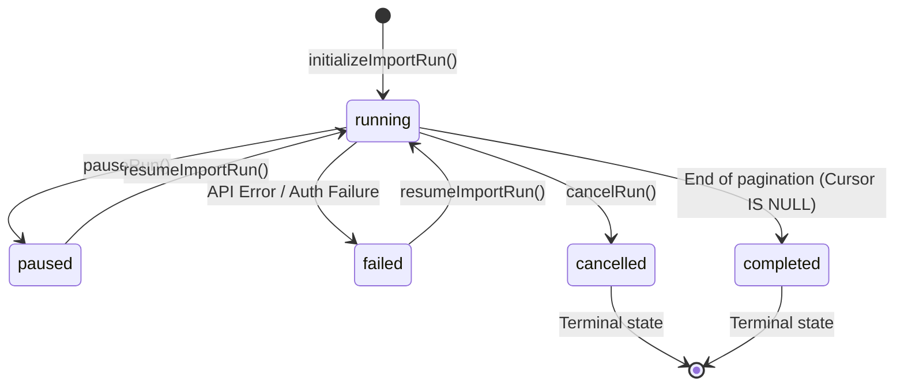

# WiGLE Import Player & V2 Ingestion Subsystem

The **WiGLE Import Player** coordinates paginated, rate-limit-aware ingestion of crowd-sourced wireless observations from the external WiGLE API. This documentation serves as the technical guide for the ingestion lifecycle, database ledgers, rate-limiting strategies, and operator safety protocols.

> [!WARNING]
> **Do not restart or rerun WiGLE imports blindly.** Always utilize the import run/page ledger and resume controls so that completed pages are automatically skipped and rate-limit-safe pacing is preserved. Flooding the API can result in account locks or circuit-breaker trips.

---

## 1. Subsystem Architecture

The pipeline consists of three core components:

- **Ingestion Orchestrator (`WigleImportRunOrchestrator`)**: Owns the fetch loop, paging controls, page processors, and failure recovery.
- **Request Ledger (`wigleRequestLedger`)**: Tracks API calls within a rolling 24-hour window, enforces soft limits, and manages the circuit breaker.
- **Run/Page Database Ledger**: Persists execution history, checkpoint cursors, and row statistics to prevent duplicate queries and split states.

---

## 2. Ingestion Lifecycle & States

An import run transitions through the following statuses (defined by type `WigleImportRunStatus` in `runStateManager.ts`):



### State Transitions

- **New Run**: Created via `initializeImportRun()`. The orchestrator normalizes parameters and generates a query fingerprint. If a resumable run with the same query fingerprint already exists, the orchestrator automatically resumes it instead of creating a duplicate.
- **Active Run (`running`)**: Loop iteratively fetches data page-by-page. Before each request, the orchestrator checks `app.wigle_import_runs` to verify if the run's status was changed to `paused` or `cancelled` by an operator request.
- **Pause**: Marked via `pauseRun()`. The fetch loop safely exits at the next page iteration boundary, preserving the last successful cursor and page checkpoint.
- **Resume**: Initiated via `prepareRunForResumption()`. The orchestrator runs `reconcileRunProgress()` to reconstruct progress statistics from `app.wigle_import_run_pages`, updates the run record with the last successful page number + cursor, and resets status to `running`.
- **Stop/Cancel**: Triggered via `cancelRun()`. Terminal state. The run cannot be resumed.
- **Completion**: Marked via `completeRun()`. Occurs when the WiGLE API returns an empty result set and a `null` search-after cursor, or when the current page index meets or exceeds calculated `total_pages`.

---

## 3. The Ledger & Accounting Model

To prevent duplicate API calls and network data fragmentation, ShadowCheck relies on a two-tier database ledger:

### `app.wigle_import_runs`

Tracks the global state of a search request.

- `request_fingerprint`: A unique SHA-256 hash of the normalized search parameters (SSID, BSSID, state, region).
- `status`: Current run status.
- `api_cursor`: The `search_after` cursor string returned by the last successful page fetch.
- `next_page`: The page index to fetch next.
- `rows_returned`: Running count of raw rows received from the API.
- `rows_inserted`: Running count of successfully inserted new networks.

### `app.wigle_import_run_pages`

Tracks individual pages within a run.

- `run_id` & `page_number` (Composite Primary Key).
- `request_cursor` & `next_cursor`: Checks if pagination remains contiguous.
- `rows_returned` & `rows_inserted`: Tracks page-level stats.
- `success` (boolean) & `error_message` (text).

### Idempotency & Write Accounting

Observations are written to `app.wigle_v2_networks_search` using an upsert guard:

```sql
INSERT INTO app.wigle_v2_networks_search (...)
VALUES (...)
ON CONFLICT (bssid, trilat, trilong, lastupdt) DO NOTHING
```

The query returns `result.rowCount`. This returned count is added to the page's `rows_inserted` value:

- If the network location details already exist, the database does nothing and returns `0`.
- If the record is new, it returns `1`.

---

## 4. Import Progress vs. Coverage Truth

- **Import Progress** (`rows_returned` or `rows_inserted` in `app.wigle_import_runs`) measures paging velocity and run completeness. It is **not** a reflection of database coverage.
- **Database Coverage** (`stored_count`) is the actual count of unique, distinct BSSIDs successfully stored locally in the database.
- **Forensic Distinction**: Because duplicate rows are skipped via `ON CONFLICT DO NOTHING`, `rows_inserted` will always be equal to or less than `rows_returned`. To find the true coverage of a search region, operators must check `stored_count` from `app.wigle_v2_networks_search` (using `COUNT(DISTINCT bssid)`), which aggregates all historic imports, rather than reviewing progress totals on individual runs.

### Jurisdiction Probe Policy

- `server/src/constants/jurisdictions.ts` is the canonical server-side list for automated US jurisdiction dispatch. The client mirrors the same 56-entry display list because client code cannot import server modules.
- The daemon sends supported jurisdictions as `country=US&region=<code>`. Puerto Rico (`PR`) follows this normal supported path along with the 50 states and District of Columbia.
- American Samoa (`AS`), Guam (`GU`), the Northern Mariana Islands (`MP`), and the U.S. Virgin Islands (`VI`) are marked `unverified`. The daemon excludes them from automatic starts and resumes until their WiGLE behavior is explicitly verified and the policy is changed.
- The Coverage Grid keeps unverified territories visible but labels them **Unverified**, displays no numeric import count when no report row exists, and does not present them as failed or zero-result coverage.
- The Coverage Grid's primary number is the selected term's local unique-BSSID count from `app.wigle_v2_networks_search`, grouped by region. Local row counts are returned alongside it; import-run `rows_inserted` and status remain secondary progress metadata.
- Local term matching uses case-insensitive `ILIKE` with the same pattern supplied to the WiGLE `ssidlike` search. Remote `totalResults`, snapshots, and gap scoring are separate future coverage work.

---

## 5. Rate-Limit Safety & Circuit Breakers

To avoid getting locked out of the WiGLE API, the system implements strict throttling and circuit breaker logic:

### Adaptive Throttling

Between page fetches, the orchestrator pauses for a calculated delay:
$$\text{Delay} = (\text{Base Delay} \times \text{Multiplier}) + \text{Jitter}$$

- **Base Delay**: 1500 ms.
- **Multiplier**: $1 + (\text{Search Load})^2$, where search load is the ratio of calls within 24h over the configured soft limit.
- **Jitter**: Random noise between 0 and 1000 ms to prevent regular call spikes.

### Quota Ledger & Limits

The `wigleRequestLedger` records all API calls in memory and mirrors them in `app.wigle_ledger_events` for persistence across restarts. It enforces daily soft limits:

- `search`: 50 requests/day (configurable via `WIGLE_SOFT_LIMIT_SEARCH`).
- `stats`: 49 requests/day (configurable via `WIGLE_SOFT_LIMIT_STATS`).
- `detail`: Monitored but uncapped (used to gather baseline data on rate limits).
- **Hard Limit**: Automatically calculated as double the soft limit.

### Global Circuit Breaker

If the server receives **5 consecutive 429 Rate Limit responses** from WiGLE:

1.  The circuit breaker status changes to **OPEN** for **10 minutes** (600,000 ms).
2.  Any incoming background import tasks are immediately rejected with a `503 Service Unavailable` status without hitting the WiGLE endpoints.
3.  Interactive (user-driven) queries bypass the breaker, but remain subject to soft limits.

### Halting on 429

When a single `429` error is received during a run:

1.  The orchestrator sleeps for the duration requested in the API `Retry-After` header (plus random jitter). If no header is present, it defaults to a 60-second backoff.
2.  The orchestrator retries the page query **once**.
3.  If the retry fails with a 429 again, the orchestrator immediately sets the run status to `paused` and halts execution to protect the user's API quota.

---

## 6. Operator Workflows & Error Recovery

### Safe Import Controls

Operators use the **WiGLE Control Panel** in the client UI to manage runs:

- **Start**: Kicks off a paginated run.
- **Pause**: Stops execution after completing the current page. Safely stores the cursor checkpoint.
- **Resume**: Reads progress history, locates the last successful cursor, and restarts the run.
- **Cancel**: Terminates the run permanently.

### Safety Guards

- **Cluster Guard**: Refuses to launch a new identical search if 3 or more cancelled runs with the same fingerprint were created within the last 60 seconds. Operators must execute a "Clean Up" command first to clear the cancelled records.
- **Crash Recovery**: If the node process terminates mid-page, the database transaction is rolled back. The run is left in the `running` state. When the operator triggers `/resume`, the service runs `reconcileRunProgress()` to inspect the page ledger, updates the run's pointer back to the last successfully committed page, and restarts the loop safely.

---

## 7. Subsystem Blueprint

### API Endpoints

All endpoints are protected and require `admin` permissions:

- `GET /api/v1/wigle/search-api/import-runs` — Lists all historic and active runs.
- `GET /api/v1/wigle/search-api/import-runs/resumable/latest` — Checks if a query is resumable.
- `POST /api/v1/wigle/search-api/import-runs/:id/resume` — Resumes a run.
- `POST /api/v1/wigle/search-api/import-runs/:id/pause` — Pauses a run.
- `POST /api/v1/wigle/search-api/import-runs/:id/cancel` — Cancels a run.
- `GET /api/wigle/quota-status` — Returns daily call counts and circuit breaker status.
- `POST /api/wigle/quota-reset` — Resets the request ledger cache.
- `PATCH /api/wigle/soft-limits` — Changes soft limits in the running process without a server restart.

### Database Tables & Views

- `app.wigle_import_runs` — Stores parent run parameters and state coordinates.
- `app.wigle_import_run_pages` — Stores page-level pagination checkpoints.
- `app.wigle_ledger_events` — Persisted request tracking database.
- `app.wigle_v2_networks_search` — Targets for search/coverage network data.

### Test Suites

The ingestion and ledger subsystems are covered by the following test specs:

- `tests/unit/services/wigleImport/runRepository.test.ts` — Verifies database transactions and progression.
- `tests/unit/wigleImport/runReadRepository.test.ts` — Tests fingerprint matchers and duplicates handlers.
- `tests/unit/wigleImportRunRepository.test.ts` — Database integration tests.
- `tests/unit/wigleImportRunService.test.ts` — Ingestion state transitions.
- `tests/unit/wigleImportRunService.extended.test.ts` — Edge cases and backoff loops.
- `tests/unit/services/wigleRequestLedger.test.ts` — Limits, quota status, and circuit breaker logic.
